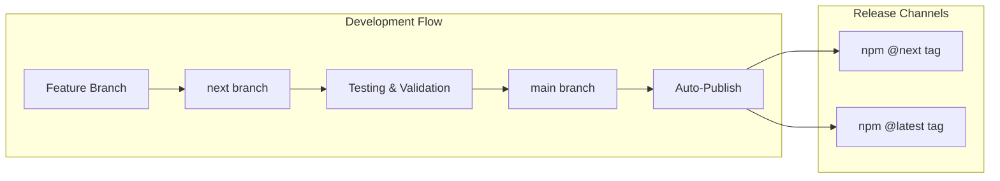

# Contributing to AI Toolkit

Welcome to the AI Toolkit project! We're excited that you're interested in contributing. This guide will help you understand our development workflow, branch strategy, and how to make contributions that align with our standards.

## Table of Contents

- [Development Workflow](#development-workflow)
- [Getting Started](#getting-started)
- [Branch Strategy](#branch-strategy)
- [Making Changes](#making-changes)
- [Code Quality](#code-quality)
- [Testing](#testing)
- [Submitting Changes](#submitting-changes)
- [Package Publishing](#package-publishing)
- [Creating New Components](#creating-new-components)
- [Commit Conventions](#commit-conventions)
- [Development Tools](#development-tools)

## Development Workflow

We follow a **trunk-based development** model with continuous integration and automated publishing:



### Key Principles

1. **`main` branch**: Stable, production-ready code
2. **`next` branch**: Integration branch for new features and testing
3. **Feature branches**: Short-lived branches for specific changes
4. **Automated publishing**: Changes to `main` and `next` trigger automatic package releases
5. **Independent versioning**: Each package has its own version number

## Getting Started

### Prerequisites

- **Node.js 22+** with npm
- **Git** configured with your GitHub credentials

### Initial Setup

1. **Clone the repository**:

   ```bash
   git clone https://github.com/Uniswap/ai-toolkit
   cd ai-toolkit
   ```

2. **Install dependencies**:

   ```bash
   npm install  # This also sets up git hooks automatically
   ```

3. **Install development tools**:

   ```bash
   # Install Nx Console for your IDE (recommended)
   # VSCode/Cursor: Install "Nx Console" extension
   # IntelliJ: Install "Nx Console" plugin

   # Install MCP server for AI assistance
   claude mcp add nx-mcp npx nx-mcp@latest --scope user
   ```

## Branch Strategy

### Branch Purposes

| Branch      | Purpose                       | Publishes To  | Version Format |
| ----------- | ----------------------------- | ------------- | -------------- |
| `main`      | Stable, production code       | `@latest`     | `1.0.0`        |
| `next`      | Feature integration & testing | `@next`       | `1.0.0-next.0` |
| `feature/*` | Individual features           | Not published | N/A            |

### Workflow Examples

#### Standard Feature Development

```bash
# 1. Start from next branch
git checkout next
git pull origin next

# 2. Create feature branch
git checkout -b feature/my-awesome-feature

# 3. Make changes and commit
# ... make changes ...
git add .
git commit -m "feat: add awesome feature"

# 4. Push and create PR to next
git push origin feature/my-awesome-feature
# Create PR via GitHub UI targeting 'next' branch
```

#### Hotfix to Main

```bash
# 1. For critical fixes only
git checkout main
git pull origin main

# 2. Create hotfix branch
git checkout -b hotfix/critical-bug

# 3. Make minimal fix
# ... fix bug ...
git add .
git commit -m "fix: resolve critical issue"

# 4. Push and create PR to main
git push origin hotfix/critical-bug
# Create PR via GitHub UI targeting 'main' branch
```

### Automatic Branch Synchronization

After changes are merged to `main`, an automated workflow rebases `next` onto `main`:

1. **Automatic rebase**: CI attempts to rebase `next` onto `main`
2. **Conflict handling**: If conflicts occur, an issue is created for manual resolution
3. **Continuous integration**: Keeps `next` up-to-date with stable changes

## Making Changes

### Before You Start

1. **Check existing issues**: Look for related issues or discussions
2. **Communicate**: For large changes, discuss in an issue first
3. **Update from upstream**: Ensure your branch is current

### Development Process

1. **Understand the codebase**:

   ```bash
   # Use Nx to explore the project structure
   npx nx graph

   # List all projects
   npx nx show projects
   ```

2. **Make focused changes**:

   - Keep PRs small and focused on a single concern
   - Write clear, self-documenting code
   - Follow existing patterns and conventions

3. **Update documentation**:
   - Update relevant README.md files
   - Update CLAUDE.md files for AI assistant context
   - Add JSDoc comments for public APIs

## Code Quality

### Automated Checks

Our codebase enforces quality through automated checks:

1. **Pre-commit hooks** (via Lefthook):

   - Formats code with Prettier
   - Runs ESLint on affected files
   - Executes automatically on `git commit`

2. **CI/CD checks**:
   - Full linting and formatting verification
   - Test execution
   - Build validation

### Manual Quality Checks

Before committing:

```bash
# Format all uncommitted files
npx nx format:write --uncommitted

# Lint affected projects
npx nx affected --target=lint --base=HEAD~1

# Fix auto-fixable lint issues
npx nx affected --target=lint --base=HEAD~1 --fix

# Run type checking
npx nx affected --target=typecheck --base=HEAD~1
```

These automatically happen via Lefthook on commit, but you can run them manually to ensure quality before committing, if you want!

### Skipping Hooks (Use Sparingly)

```bash
# Skip pre-commit hooks for WIP commits
git commit --no-verify -m "WIP: work in progress"

# Or use environment variable
LEFTHOOK=0 git commit -m "WIP: temporary commit"
```

## Testing

### Running Tests

```bash
# Test affected projects
npx nx affected --target=test --base=HEAD~1

# Test specific package
npx nx test package-name

# Test with coverage
npx nx test package-name --coverage

# Run all tests
npx nx run-many --target=test
```

### Writing Tests

- Write tests for new features and bug fixes
- Aim for high code coverage (>80%)
- Include unit tests and integration tests
- Test edge cases and error conditions

## Submitting Changes

### Pull Request Process

1. **Create PR with clear description**:

   - Describe what changes were made and why
   - Link related issues
   - Include screenshots for UI changes
   - List breaking changes if any

2. **PR title format**:

   ```
   type(scope): description

   Examples:
   feat(ai-toolkit-nx-claude): add new generator
   fix(agents): resolve context loading issue
   docs: update contribution guidelines
   ```

3. **PR checks**:
   - All CI checks must pass
   - Code review approval required
   - Merge conflicts resolved

### Merge Strategy

- **Feature PRs**: Merge to `next` first for testing
- **Hotfixes**: Can merge directly to `main` if critical
- **Documentation**: Can merge to `main` directly

## Package Publishing

### Automated Publishing Process

Publishing happens automatically through GitHub Actions:

1. **Trigger**: Push (via PR) to `main` or `next` branch
2. **Version bump**: Based on conventional commits
3. **Build**: All packages are built
4. **Publish**: Packages published to npmjs
5. **Git tags**: Version tags created and pushed

### Version Management

| Branch | Version Strategy       | Example        |
| ------ | ---------------------- | -------------- |
| `main` | Standard semver        | `1.2.3`        |
| `next` | Prerelease with suffix | `1.2.3-next.0` |

## Creating New Components

### New Package

```bash
# Create a new publishable library
npx nx g @nx/js:lib packages/ai-toolkit-my-package \
  --publishable \
  --importPath=@uniswap/ai-toolkit-my-package
```

### New Agent

```bash
# Use the generator
npx nx generate @uniswap/ai-toolkit-nx-claude:add-agent

# Or manually create in packages/agents/agnostic/
# Follow the agent template format
```

### New Command

```bash
# Use the generator
npx nx generate @uniswap/ai-toolkit-nx-claude:add-command

# Or manually create in packages/commands/agnostic/
# Follow the command template format
```

### New Nx Generator

```bash
# Create generator in ai-toolkit-nx-claude package
npx nx generate @nx/plugin:generator my-generator \
  --project=ai-toolkit-nx-claude
```

## Commit Conventions

We use [Conventional Commits](https://www.conventionalcommits.org/) to automate versioning:

### Format

```md
type(scope): description

[optional body]

[optional footer(s)]
```

### Types

| Type       | Description             | Version Bump  |
| ---------- | ----------------------- | ------------- |
| `feat`     | New feature             | Minor (0.X.0) |
| `fix`      | Bug fix                 | Patch (0.0.X) |
| `docs`     | Documentation only      | No bump       |
| `style`    | Code style changes      | No bump       |
| `refactor` | Code refactoring        | No bump       |
| `perf`     | Performance improvement | Patch         |
| `test`     | Test changes            | No bump       |
| `chore`    | Build/tooling changes   | No bump       |

### Breaking Changes

Add `BREAKING CHANGE:` in the footer or `!` after the type:

```bash
feat!: remove deprecated API

# Or with footer
feat: update API

BREAKING CHANGE: removed support for v1 endpoints
```

### Examples

```bash
# Feature
git commit -m "feat(agents): add new context-aware planner"

# Bug fix
git commit -m "fix(commands): resolve parsing issue in plan command"

# Documentation
git commit -m "docs: update contribution guidelines"

# Breaking change
git commit -m "feat(ai-toolkit-nx-claude)!: change generator API"
```

## Development Tools

### Nx Commands

```bash
# Visualize project graph
npx nx graph

# Show affected projects
npx nx affected:graph --base=main

# Run command for all projects
npx nx run-many --target=build

# Run command for affected projects
npx nx affected --target=test --base=main

# Reset Nx cache
npx nx reset
```

We recommend you using the Nx Console IDE extension!

### Useful Scripts

```bash
# Walkthrough the core of what we've built (for new contributors)
npm run install-all

# Format and lint everything
npx nx format:write
npx nx run-many --target=lint --fix

# Build all packages
npx nx run-many --target=build
```

### Debugging

1. **Verbose output**: Add `--verbose` to Nx commands
2. **Cache issues**: Run `npx nx reset`
3. **Dependency issues**: Run `npm install` again
4. **Git hook issues**: Check Lefthook with `npx lefthook run pre-commit`

## Getting Help

### Resources

- **Documentation**: Check package-level README.md and CLAUDE.md files
- **Issues**: [GitHub Issues](https://github.com/Uniswap/ai-toolkit/issues)
- **Discussions**: [GitHub Discussions](https://github.com/Uniswap/ai-toolkit/discussions)
- **Slack**: [#pod-dev-ai](https://uniswapteam.enterprise.slack.com/archives/C094URH6C13)

### Common Issues

1. **Build failures**: Check Node version requirements
2. **Test failures**: Run `npx nx reset` and try again
3. **Merge conflicts**: Rebase your branch on latest `next`

### Reporting Issues

If you experience or witness unacceptable behavior, please report it to the project maintainers or open an GitHub Issue.

---

Thank you for contributing to AI Toolkit! Your efforts help make AI-assisted development better for everyone at Uniswap. 🚀
