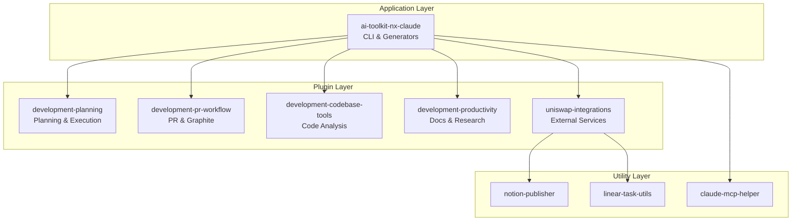
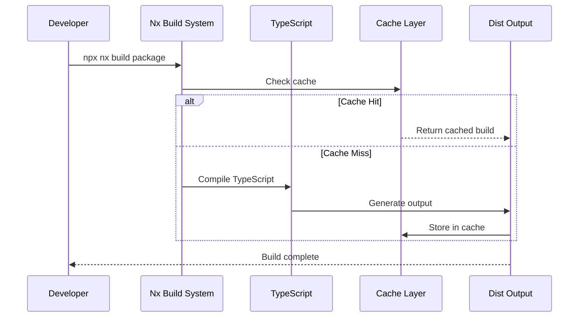
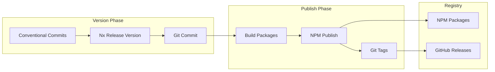
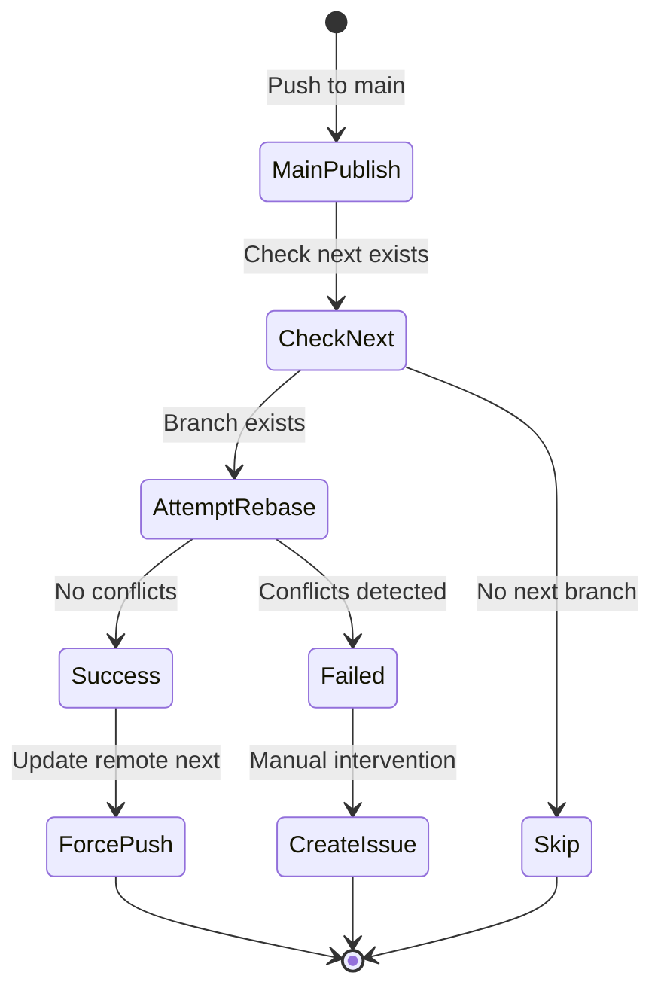

# Development Guide

This document provides a technical deep-dive into the AI Toolkit development infrastructure, including the monorepo architecture, CI/CD pipelines, and advanced development workflows.

## Table of Contents

- [Monorepo Architecture](#monorepo-architecture)
- [Package Structure](#package-structure)
- [Build System](#build-system)
- [CI/CD Pipeline](#cicd-pipeline)
- [Version Management](#version-management)
- [Branch Synchronization](#branch-synchronization)
- [Local Development](#local-development)
- [Debugging & Troubleshooting](#debugging--troubleshooting)
- [Performance Optimization](#performance-optimization)

## Monorepo Architecture

### Nx Workspace Configuration

The AI Toolkit uses [Nx](https://nx.dev) as its monorepo build system, providing:

- **Smart Build System**: Only rebuilds what changed
- **Dependency Graph**: Automatic understanding of package relationships
- **Task Orchestration**: Parallel execution of tasks
- **Caching**: Local and distributed caching for faster builds
- **Code Generation**: Scaffolding tools for consistency

### Core Configuration Files

```yaml
nx.json:
  - Target defaults and build configurations
  - Cache settings and task pipelines
  - Plugin configurations
  - Release configuration for publishing

package.json:
  - Workspace scripts and dependencies
  - Lefthook configuration for git hooks

tsconfig.base.json:
  - TypeScript path mappings
  - Compiler options for all packages
```

### Dependency Management



## Package Structure

### Package Types

| Type             | Purpose             | Publishing       | Examples                                |
| ---------------- | ------------------- | ---------------- | --------------------------------------- |
| **Applications** | User-facing tools   | Published        | `@uniswap/ai-toolkit-nx-claude`         |
| **Libraries**    | Shared code         | May be published | `@uniswap/ai-toolkit-linear-task-utils` |
| **Plugins**      | Claude Code plugins | Private          | `packages/plugins/*`                    |

### Package Anatomy

```tree
packages/[package-name]/
├── src/                 # Source code
│   ├── index.ts        # Public API exports
│   └── ...
├── project.json        # Nx project configuration
├── package.json        # Package metadata
├── tsconfig.json       # TypeScript config
├── tsconfig.lib.json   # Build-specific config
├── README.md           # User documentation
└── CLAUDE.md           # AI assistant context
```

### Package Naming Conventions

- **Scopes**:
  - `@uniswap/*`: Public packages for Uniswap organization
  - `@ai-toolkit/*`: Internal/private packages
- **Names**: Use kebab-case (e.g., `ai-toolkit-nx-claude`)
- **Directories**: Match package name without scope

## Build System

### Build Pipeline



### Build Commands

```bash
# Build single package
npx nx build package-name

# Build all packages
npx nx run-many --target=build

# Build affected packages
npx nx affected --target=build --base=main

# Build with dependencies
npx nx build package-name --with-deps

# Build in watch mode
npx nx build package-name --watch
```

### Build Optimization

1. **Incremental Builds**: TypeScript incremental compilation
2. **Parallel Execution**: Builds run in parallel when possible
3. **Smart Caching**: Results cached locally and remotely
4. **Dependency Ordering**: Respects inter-package dependencies

## CI/CD Pipeline

### GitHub Actions Workflow

Our CI/CD uses `.github/workflows/ci-publish-packages.yml`:

```yaml
Workflow Triggers:
  - Push to main branch (stable releases)
  - Push to next branch (prereleases)
  - Manual workflow dispatch (with dry-run option)

Jobs:
  1. publish:
    - Setup environment (Node, Git)
    - Determine npm tag (latest/next)
    - Build all packages
    - Version affected packages
    - Publish to npmjs Packages
    - Push tags and commits
    - Create GitHub releases

  2. sync-next:
    - Only runs after main publishes
    - Rebases next onto main
    - Handles conflicts with issue creation
```

### Publishing Process Deep-Dive

#### 1. Version Detection

```bash
# For next branch (prerelease)
npx nx release version prerelease --preid=next
# Results in: 1.0.0-next.0, 1.0.0-next.1, etc.

# For main branch (stable)
npx nx release version --specifier=patch
# Results in: 1.0.0, 1.0.1, 1.1.0, etc.
```

#### 2. Affected Package Detection

Nx analyzes the dependency graph to determine which packages changed:

```bash
# Internally, Nx runs:
nx show projects --affected --base=HEAD~1

# This considers:
- Direct file changes
- Dependency changes
- Configuration changes
```

#### 3. Publishing Strategy



### Environment Variables

```bash
# Required for reading from npmjs
GITHUB_TOKEN        # GitHub authentication

# Optional for configuration
NX_CLOUD_AUTH_TOKEN # Nx Cloud distributed caching
```

## Version Management

### Conventional Commits

We use [Conventional Commits](https://www.conventionalcommits.org/) to automate versioning:

```bash
# Version bump mapping
feat:     → Minor bump (0.X.0)
fix:      → Patch bump (0.0.X)
feat!:    → Major bump (X.0.0)
BREAKING: → Major bump (X.0.0)

# Examples
git commit -m "feat(agents): add new AI agent"      # 1.0.0 → 1.1.0
git commit -m "fix(commands): resolve parsing bug"   # 1.1.0 → 1.1.1
git commit -m "feat!: redesign API"                  # 1.1.1 → 2.0.0
```

### Independent Package Versioning

Each package versions independently based on its changes:

```json
// nx.json
{
  "release": {
    "projectsRelationship": "independent",
    "projects": [
      "@uniswap/ai-toolkit-nx-claude", // 1.2.3
      "@uniswap/ai-toolkit-claude-mcp-helper", // 0.1.0
      "@uniswap/ai-toolkit-linear-task-utils" // 0.2.0
    ]
  }
}
```

### Version Resolution

```bash
# Check current versions
npx nx show projects --with-target version

# Preview version changes (dry-run)
npx nx release version --dry-run

# Generate changelog
npx nx release changelog

# Full release (version + publish)
npx nx release
```

## Branch Synchronization

### Automatic Rebase Workflow

After publishing to `main`, the CI automatically syncs `next`:



### Manual Conflict Resolution

When automatic sync fails:

```bash
# 1. Fetch latest changes
git fetch origin

# 2. Checkout next branch
git checkout next

# 3. Rebase onto main
git rebase origin/main

# 4. Resolve conflicts
# Edit conflicted files
git add .
git rebase --continue

# 5. Force push (with lease for safety)
git push origin next --force-with-lease
```

### Alternative: Graphite CLI

The workflow includes Graphite as a fallback:

```bash
# Initialize Graphite
gt init --trunk main --no-interactive

# Sync branches
gt sync --force --no-interactive
```

## Local Development

### Development Setup

```bash
# 1. Clone and setup
git clone https://github.com/Uniswap/ai-toolkit
cd ai-toolkit
npm install

# 2. Create development branch
git checkout next
git checkout -b feature/my-feature

# 3. Start development
npx nx serve package-name --watch
```

### Testing Changes Locally

#### Test Generators Locally

```bash
# Build the generator package
npx nx build ai-toolkit-nx-claude

# Test addons generator with dry-run
npx nx generate @uniswap/ai-toolkit-nx-claude:addons --dry-run
```

#### Test Packages Before Publishing

```bash
# Create local package
npx nx build package-name
cd dist/packages/package-name
npm pack

# Install in test project
cd /tmp/test-project
npm install /path/to/package-name-1.0.0.tgz
```

### Development Commands

```bash
# Format code
npm run format

# Lint with fixes
npx nx affected --target=lint --fix

# Run tests
npx nx affected --target=test

# Type check
npx nx affected --target=typecheck

# Clean build artifacts
npx nx reset

# Update dependencies
npx nx migrate latest
```

## Debugging & Troubleshooting

### Common Issues and Solutions

#### 1. Build Failures

```bash
# Clear cache and rebuild
npx nx reset
npx nx run-many --target=build --skip-nx-cache

# Check for circular dependencies
npx nx graph

# Verbose output for debugging
npx nx build package-name --verbose
```

#### 2. Publishing Failures

```bash
# Check authentication
npm whoami

# Test publishing with dry-run
npx nx release publish --dry-run
```

#### 3. Version Conflicts

```bash
# Reset to last published version
git tag -d package-name@1.0.0  # Delete local tag
git push origin :package-name@1.0.0  # Delete remote tag

# Fix version in package.json
npx nx release version --specifier=1.0.0 --projects=package-name
```

#### 4. Git Hook Issues

```bash
# Reinstall hooks
npx lefthook uninstall
npx lefthook install

# Run hooks manually
npx lefthook run pre-commit

# Skip hooks temporarily
LEFTHOOK=0 git commit -m "message"
```

### Debug Environment Variables

```bash
# Enable verbose logging
export NX_VERBOSE_LOGGING=true

# Disable daemon (for debugging)
export NX_DAEMON=false

# Force color output
export FORCE_COLOR=true

# Skip cache
export NX_SKIP_NX_CACHE=true
```

### Nx Console Debugging

For VS Code / Cursor users:

1. Install Nx Console extension
2. Open Command Palette: `Cmd+Shift+P`
3. Run: "Nx: Show Debug Information"
4. View Nx graph: "Nx: Show Project Graph"

## Performance Optimization

### Build Performance

```bash
# Analyze build performance
npx nx build package-name --profile

# View performance report
open profile.html

# Optimize TypeScript builds
# In tsconfig.json:
{
  "compilerOptions": {
    "incremental": true,
    "tsBuildInfoFile": ".tsbuildinfo"
  }
}
```

### Caching Strategies

#### Local Cache

```json
// nx.json
{
  "cacheDirectory": "node_modules/.cache/nx",
  "tasksRunnerOptions": {
    "default": {
      "runner": "nx/tasks-runners/default",
      "options": {
        "cacheableOperations": ["build", "test", "lint"]
      }
    }
  }
}
```

#### Distributed Cache (Nx Cloud)

```bash
# Connect to Nx Cloud
npx nx connect

# Configure in nx.json
{
  "nxCloudAccessToken": "your-token"
}
```

### Parallel Execution

```bash
# Configure parallelism
npx nx run-many --target=build --parallel=4

# In nx.json
{
  "parallel": 5  // Default parallel processes
}
```

### Memory Management

```bash
# Increase Node memory for large builds
export NODE_OPTIONS="--max-old-space-size=8192"

# Run with increased memory
NODE_OPTIONS="--max-old-space-size=8192" npx nx build
```

## Advanced Topics

### Custom Nx Executors

Create custom build steps:

```typescript
// packages/tools/executors/custom/executor.ts
export default async function customExecutor(options, context) {
  // Custom build logic
  return { success: true };
}
```

### Workspace Generators

Create project templates:

```bash
# Generate a new generator
npx nx g @nx/plugin:generator my-generator --project=tools

# Use the generator
npx nx g @myorg/tools:my-generator
```

### Task Dependencies

Define complex task relationships:

```json
// project.json
{
  "targets": {
    "build": {
      "dependsOn": ["^build", "generate-types"],
      "inputs": ["production", "^production"]
    }
  }
}
```

---

For additional help, see:

- [CONTRIBUTING.md](./CONTRIBUTING.md) - Contribution guidelines
- [WORKFLOW.md](./WORKFLOW.md) - Development workflow guide
- [Nx Documentation](https://nx.dev) - Official Nx docs
- [GitHub Issues](https://github.com/Uniswap/ai-toolkit/issues) - Report problems
