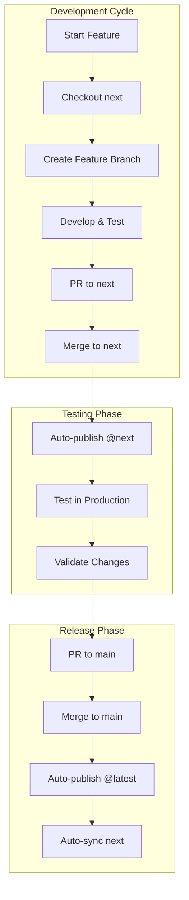

# Development Workflow Guide

This guide provides a complete walkthrough of the AI Toolkit development workflow, from initial setup through feature development, testing, and release.

## Workflow Overview



## Complete Development Workflows

### Workflow 1: Standard Feature Development

This is the most common workflow for adding new features or improvements.

#### Step 1: Setup Your Environment

```bash
# Clone the repository (first time only)
git clone https://github.com/Uniswap/ai-toolkit
cd ai-toolkit

# Install dependencies
bun install  # Installs deps + git hooks

# Ensure you're up to date
git fetch origin
git checkout next
git pull origin next
```

#### Step 2: Create Your Feature Branch

```bash
# Create feature branch from next
git checkout -b feature/amazing-feature

# Alternatively, for bug fixes
git checkout -b fix/bug-description
```

#### Step 3: Develop Your Feature

```bash
# Make your changes
# ... edit files ...

# Run quality checks frequently
bunx nx format:write --uncommitted  # Format code
bunx nx affected --target=lint --base=next  # Lint
bunx nx affected --target=test --base=next  # Test

# Build affected packages
bunx nx affected --target=build --base=next
```

#### Step 4: Commit Your Changes

```bash
# Stage changes
git add .

# Commit with conventional commit message
git commit -m "feat(package-name): add amazing feature"
# Pre-commit hooks run automatically

# Push to origin
git push origin feature/amazing-feature
```

#### Step 5: Create Pull Request to Next

Use the `/create-pr` Claude Code Slash command, specifying `next` as the target branch.

#### Step 6: Automatic Testing Release

Once merged to `next`:

- CI automatically publishes packages with `@next` tag
- Version becomes `X.Y.Z-next.N`
- Packages available for testing immediately

#### Step 7: Test in Production

```bash
# Install and test the prerelease
npx --@uniswap:registry=https://npm.pkg.github.com @uniswap/ai-toolkit-nx-claude@next

# Verify functionality
# Report any issues found
```

#### Step 8: Promote to Stable

Use the GitHub Actions GUI to run the [Update Production](https://github.com/Uniswap/ai-toolkit/actions/workflows/update-production.yml) workflow found in [update-production.yml](../../.github/workflows/update-production.yml).

### Workflow 2: Hotfix Process

For critical bugs that need immediate fixes in production.

#### Step 1: Create Hotfix Branch

```bash
# Start from main (not next)
git checkout main
git pull origin main
git checkout -b hotfix/critical-issue
```

#### Step 2: Make Minimal Fix

```bash
# Fix only the critical issue
# ... minimal changes ...

# Test thoroughly
bunx nx affected --target=test --base=main
```

#### Step 3: Create PR to Main

```bash
# Commit with clear message
git commit -m "fix: resolve critical production issue"
git push origin hotfix/critical-issue
```

#### Step 4: Fast-Track Review and Merge

1. Create PR to `main` (not `next`)
2. Get expedited review
3. Merge directly to `main`
4. CI publishes patch version immediately
5. `next` automatically gets the fix via rebase

### Merge Conflict Prevention

Best practices to avoid conflicts:

1. **Keep PRs Small**: Smaller changes = fewer conflicts
2. **Merge Frequently**: Don't let branches diverge too far
3. **Communicate**: Coordinate with team on large changes
4. **Rebase Early**: Keep feature branches current

## Version Management Examples

### Understanding Version Progression

#### On Next Branch

```bash
# Initial version
1.0.0

# First prerelease
feat: add feature -> 1.1.0-next.0

# Second prerelease (another feature)
feat: add another -> 1.1.0-next.1

# Fix in prerelease
fix: bug fix -> 1.1.0-next.2
```

#### Promotion to Main

```bash
# Next version: 1.1.0-next.2
# Merge to main
# Main version: 1.1.0 (strips prerelease)

# Next rebases and continues
# Next version: 1.1.0 (now matches main)
# New feature on next
feat: new feature -> 1.2.0-next.0
```

### Version Scenarios

| Scenario         | Next Version                | Main Version  | Result        |
| ---------------- | --------------------------- | ------------- | ------------- |
| Feature on next  | 1.0.0 → 1.1.0-next.0        | 1.0.0         | Testing       |
| Fix on next      | 1.1.0-next.0 → 1.1.0-next.1 | 1.0.0         | Testing       |
| Merge to main    | 1.1.0-next.1                | 1.0.0 → 1.1.0 | Released      |
| After sync       | 1.1.0                       | 1.1.0         | Aligned       |
| Breaking on next | 1.1.0 → 2.0.0-next.0        | 1.1.0         | Major testing |

## Rollback Procedures

### Rolling Back a Release

#### Option 1: Revert on Main

```bash
# Create revert PR
git checkout main
git pull origin main
git revert <commit-hash>
git push origin revert-branch

# Merge revert PR to main
# Creates new patch version with revert
```

#### Option 2: Reset and Force Push (Dangerous)

```bash
# Only if no one has downloaded the bad version
git checkout main
git reset --hard <good-commit>
git push origin main --force

# Delete bad tags
git tag -d package@bad-version
git push origin :refs/tags/package@bad-version
```

#### Option 3: Publish Patch

```bash
# Quick fix on main
git checkout main
git checkout -b hotfix/rollback
# Fix the issue
git commit -m "fix: revert problematic change"
# Fast-track merge to main
```

### Rolling Back Package Versions

```bash
# Deprecate bad version
npm deprecate @uniswap/package@1.2.3 "Critical bug - use 1.2.4"

# Publish fixed version
bunx nx release version patch --projects=package
bunx nx release publish --projects=package
```

## CI/CD Integration Points

### Pre-commit Hooks

Managed by Lefthook, runs automatically:

```yaml
pre-commit:
  commands:
    format:
      run: bunx nx format:write --uncommitted
    lint:
      run: bunx nx affected --target=lint --base=HEAD
```

### PR Checks

GitHub Actions runs on every PR:

```yaml
- Format check
- Lint check
- Test suite
- Build verification
- Type checking
```

### Merge Triggers

Different actions based on target branch:

| Event       | Branch | Action                |
| ----------- | ------ | --------------------- |
| PR Merged   | next   | Publish prerelease    |
| PR Merged   | main   | Publish stable + sync |
| Direct Push | next   | Publish prerelease    |
| Direct Push | main   | Publish stable + sync |

## Best Practices

### Commit Messages

✅ **Good:**

```bash
feat(agents): add context-aware planning agent
fix(cli): resolve path resolution on Windows
docs: update contribution guidelines
refactor(utils): simplify error handling logic
```

❌ **Bad:**

```bash
updated stuff
fix
WIP
random changes
```

Install and use the `/generate-commit-message` Claude Code slash command for assistance!

### PR Practices

✅ **Do:**

- Keep PRs focused on single purpose
- Include tests with features
- Update documentation
- Add clear descriptions
- Link related issues

❌ **Don't:**

- Mix features and refactoring
- Submit PRs with failing tests
- Ignore CI failures
- Force push to shared branches
- Merge without review

### Branch Hygiene

```bash
# Clean up old branches
git branch --merged | grep -v main | xargs git branch -d

# Prune remote branches
git remote prune origin

# Find stale branches
git for-each-ref --format='%(refname:short) %(committerdate)' \
  refs/heads/ | sort -k2
```

Or, just use Graphite!

## Troubleshooting Workflows

## Summary

The AI Toolkit workflow is designed for:

1. **Safety**: Changes tested on `next` before stable release
2. **Automation**: Minimal manual intervention required
3. **Flexibility**: Supports various development patterns
4. **Transparency**: Clear version progression and release cycles

Remember:

- Develop on feature branches
- Test on `next` branch
- Release from `main` branch
- Let automation handle the complex parts

For technical details, see [DEVELOPMENT.md](./DEVELOPMENT.md).
For contribution guidelines, see [CONTRIBUTING.md](./CONTRIBUTING.md).
