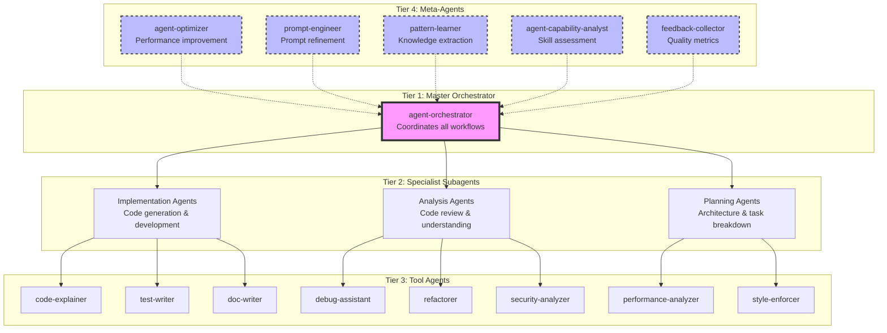
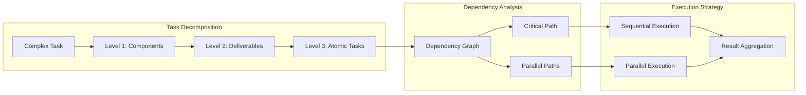
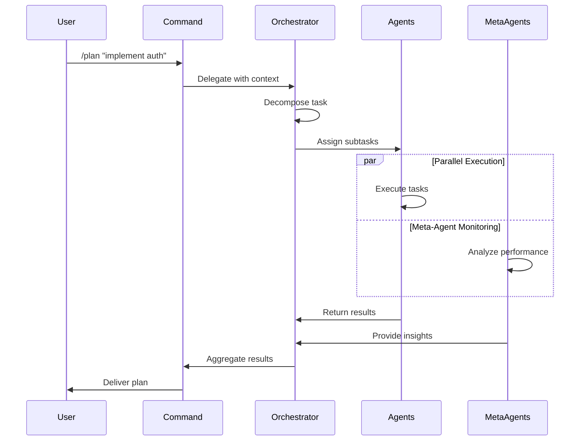
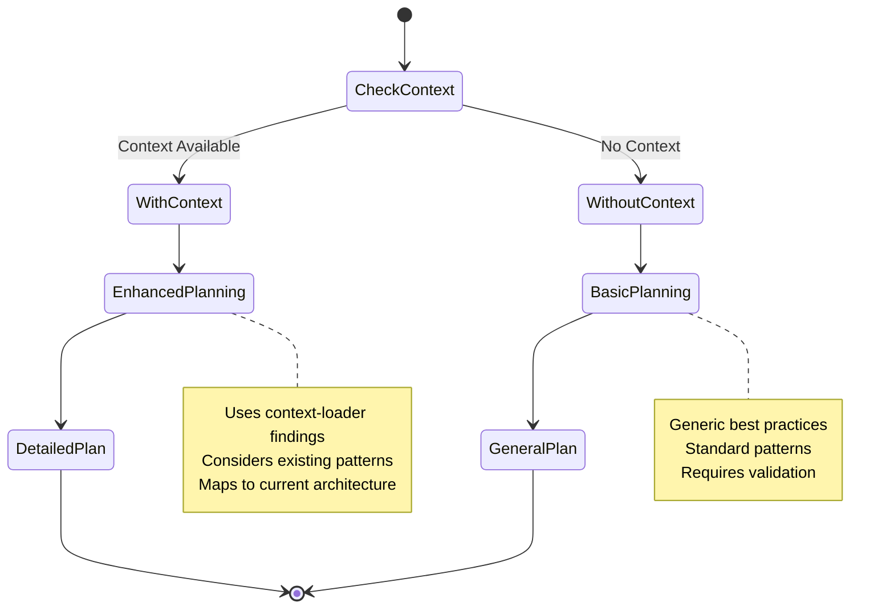
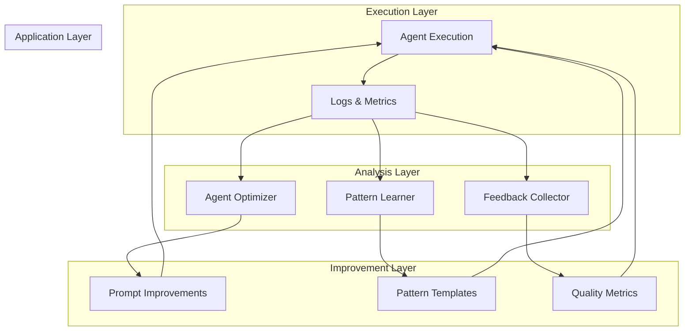
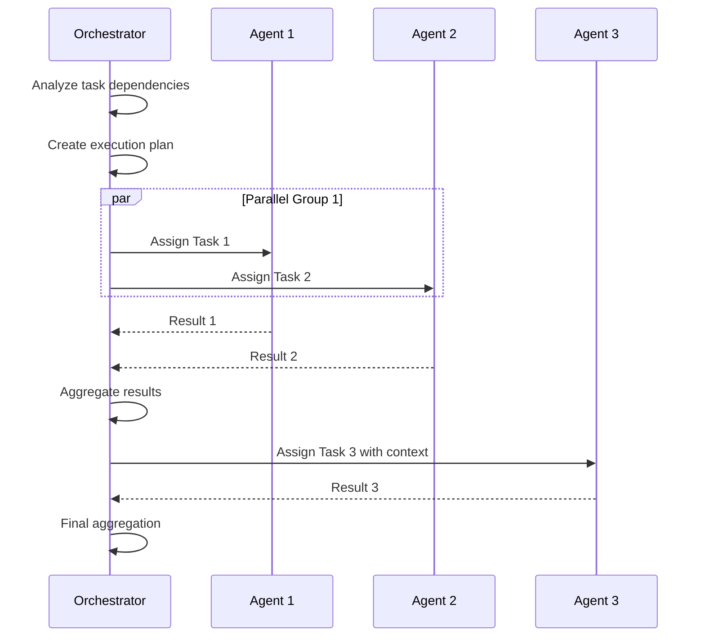
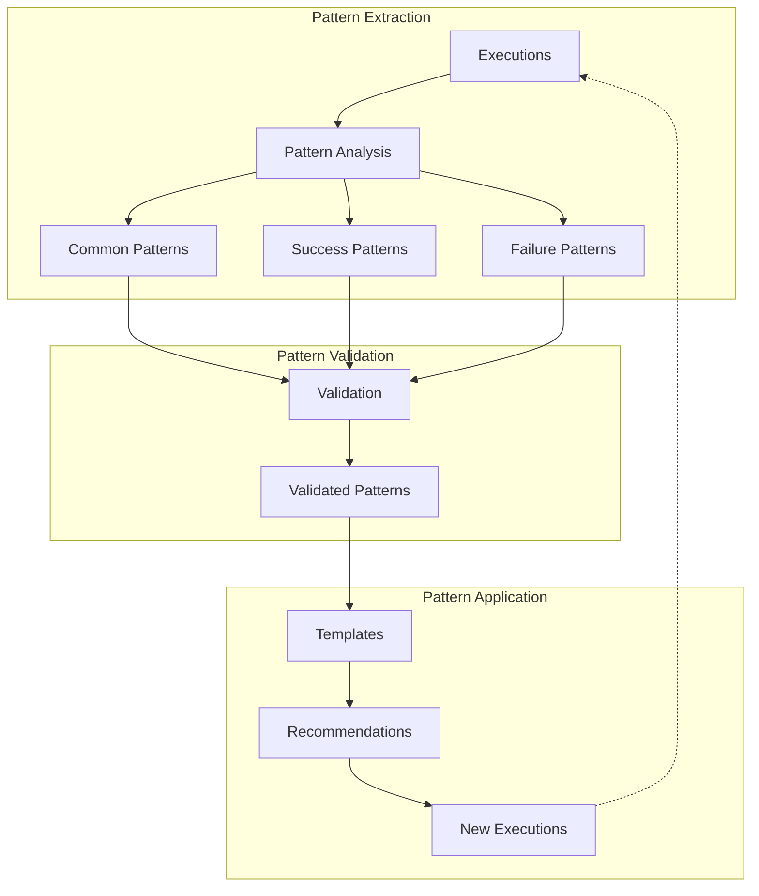
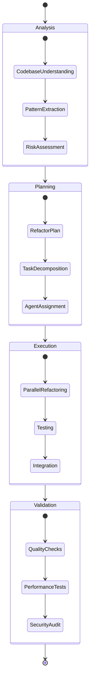

# Agent Infrastructure Architecture

## Executive Summary

The AI Toolkit agent infrastructure implements a sophisticated hierarchical agent model designed for complex software development workflows. The system leverages specialized agents organized in layers, from high-level orchestration to low-level execution, with meta-agents providing continuous improvement capabilities. This architecture enables intelligent task decomposition, parallel execution, context-aware planning, and pattern-based learning across diverse development scenarios.

## Table of Contents

1. [Hierarchical Agent Model](#hierarchical-agent-model)
2. [Agent Capabilities](#agent-capabilities)
3. [Command System](#command-system)
4. [Key Architectural Decisions](#key-architectural-decisions)
5. [Integration Patterns](#integration-patterns)
6. [Advanced Features](#advanced-features)
7. [Workflow Examples](#workflow-examples)
8. [Implementation Guide](#implementation-guide)

## Hierarchical Agent Model

The agent infrastructure follows a four-tier hierarchical model, where each layer has distinct responsibilities and capabilities:



### Master Orchestrator Role and Responsibilities

The **agent-orchestrator** serves as the central conductor for all complex workflows:

- **Hierarchical Task Decomposition**: Breaks complex tasks into atomic, executable units with dependency analysis
- **Intelligent Agent Selection**: Matches tasks to agents based on capability scoring without hardcoding
- **Parallel Execution Coordination**: Manages concurrent task execution while respecting dependencies
- **Result Aggregation**: Combines outputs from multiple agents while resolving conflicts
- **Meta-Agent Coordination**: Engages meta-agents for system optimization and improvement

### Specialist Subagents

#### Implementation Agents

Focus on code generation, development, and creation tasks:

- **code-generator**: Creates new code implementations
- **test-writer**: Develops comprehensive test suites
- **doc-writer**: Produces technical documentation

#### Analysis Agents

Specialize in understanding and evaluating existing code:

- **code-explainer**: Provides detailed code explanations
- **debug-assistant**: Identifies and resolves issues
- **security-analyzer**: Performs security audits
- **performance-analyzer**: Evaluates performance characteristics

#### Planning Agents

Handle architectural and organizational tasks:

- **planner**: Creates implementation plans with task decomposition
- **plan-reviewer**: Validates and improves existing plans
- **researcher**: Gathers information and explores solutions

### Tool Agents (Low-Level Execution)

Tool agents perform specific, focused tasks:

- Direct file manipulation and code generation
- Specialized analysis and validation
- Documentation and comment generation
- Style enforcement and formatting

### Meta-Agents (Self-Improvement Capabilities)

Meta-agents provide continuous improvement through:

#### agent-optimizer

- Analyzes agent performance metrics
- Suggests prompt improvements
- Recommends optimal agent combinations
- Identifies capability gaps

#### prompt-engineer

- Refines delegation prompts for clarity
- Optimizes context inclusion
- Improves output specifications
- Creates reusable prompt templates

#### pattern-learner

- Identifies successful delegation patterns
- Documents effective agent combinations
- Builds knowledge base of solutions
- Suggests pattern-based approaches

#### agent-capability-analyst

- Deep semantic understanding of agent capabilities
- Sophisticated scoring algorithms
- Team composition recommendations
- Confidence assessment

## Agent Capabilities

### Complete Agent Registry

| Agent                        | Primary Capability       | Key Strengths                                          | Best Use Cases               |
| ---------------------------- | ------------------------ | ------------------------------------------------------ | ---------------------------- |
| **agent-orchestrator**       | Workflow coordination    | Hierarchical decomposition, parallel execution         | Complex multi-step tasks     |
| **agent-capability-analyst** | Capability assessment    | Semantic matching, team composition                    | Agent selection optimization |
| **claude-agent-discovery**   | Agent discovery          | Finds all available agents from Claude Code dirs       | Agent catalog and listing    |
| **agent-optimizer**          | Performance improvement  | A/B testing, iterative refinement                      | Continuous improvement       |
| **prompt-engineer**          | Prompt optimization      | Clarity assessment, token efficiency                   | Prompt refinement            |
| **pattern-learner**          | Pattern extraction       | Success criteria identification, reuse recommendations | Knowledge preservation       |
| **planner**                  | Task planning            | Dependency analysis, resource estimation               | Project planning             |
| **plan-reviewer**            | Plan validation          | Risk assessment, optimization opportunities            | Quality assurance            |
| **code-generator**           | Code creation            | Language-specific generation, best practices           | Implementation tasks         |
| **code-explainer**           | Code understanding       | Documentation, complexity analysis                     | Knowledge transfer           |
| **test-writer**              | Test creation            | Coverage analysis, edge case identification            | Quality assurance            |
| **doc-writer**               | Documentation            | Technical writing, API documentation                   | Knowledge preservation       |
| **debug-assistant**          | Issue resolution         | Root cause analysis, fix suggestions                   | Problem solving              |
| **refactorer**               | Code improvement         | Pattern application, optimization                      | Code quality                 |
| **security-analyzer**        | Security audit           | Vulnerability detection, compliance checking           | Risk mitigation              |
| **performance-analyzer**     | Performance optimization | Bottleneck identification, optimization strategies     | System improvement           |
| **style-enforcer**           | Code formatting          | Convention enforcement, consistency                    | Code quality                 |
| **researcher**               | Information gathering    | Web search, documentation analysis                     | Knowledge acquisition        |
| **context-loader**           | Context building         | Codebase understanding, pattern extraction             | Preparation phase            |
| **feedback-collector**       | Quality metrics          | User satisfaction, performance tracking                | Continuous improvement       |

### Agent Capability Scoring and Matching

The system uses a multi-dimensional scoring framework:

```yaml
capability_dimensions:
  capability_match: 0-100  # Direct alignment with task requirements
    weights:
      primary_skills: 40%
      secondary_skills: 30%
      domain_expertise: 30%

  expertise_depth: 0-100  # Sophistication in required areas
    modifiers:
      specialist_bonus: +20
      generalist_penalty: -10
      experience_factor: variable

  reliability_score: 0-100  # Predicted output quality
    factors:
      - success_rate
      - complexity_handling
      - error_recovery

  efficiency_rating: 0-100  # Resource optimization
    metrics:
      - completion_speed
      - context_efficiency
      - parallel_capability

  collaboration_score: 0-100  # Team performance
    indicators:
      - output_compatibility
      - communication_clarity
      - handoff_efficiency
```

### Task Decomposition and Parallel Execution

The orchestrator employs sophisticated decomposition strategies:



### Context Management and Sharing

Context flows through the system via:

1. **Context Loader**: Builds comprehensive understanding of the codebase
2. **Context Templates**: Standardized formats for context sharing
3. **Context Preservation**: Maintains context across agent handoffs
4. **Context Optimization**: Provides only necessary context to each agent

## Command System

### Available Commands and Their Purposes

The command system provides high-level interfaces to the agent infrastructure:

| Command         | Purpose                     | Primary Agents Used                      |
| --------------- | --------------------------- | ---------------------------------------- |
| `/plan`         | Create implementation plans | planner, agent-orchestrator              |
| `/review-plan`  | Validate and improve plans  | plan-reviewer, agent-capability-analyst  |
| `/explore`      | Build codebase context      | context-loader, code-explainer           |
| `/explain-file` | Explain specific files      | code-explainer, doc-writer               |
| `/fix-bug`      | Resolve issues              | debug-assistant, test-writer             |
| `/gen-tests`    | Generate test suites        | test-writer, code-generator              |
| `/refactor`     | Improve code quality        | refactorer, style-enforcer               |
| `/research`     | Gather information          | researcher, pattern-learner              |
| `/monitor`      | Track execution             | feedback-collector, performance-analyzer |
| `/review-pr`    | Review pull requests        | code-explainer, security-analyzer        |

### Command-to-Agent Delegation Patterns



### Tool Permission Inheritance

Agents inherit tool permissions based on their role:

```yaml
permission_hierarchy:
  orchestrator:
    tools: '*' # Full access for coordination

  specialist_agents:
    implementation:
      - Write
      - Edit
      - MultiEdit
      - NotebookEdit
    analysis:
      - Read
      - Grep
      - Glob
      - LS
    planning:
      - Read
      - Write(*.md)
      - WebSearch
      - WebFetch

  meta_agents:
    tools: [] # No direct tool access, work through analysis
```

### Workflow Examples

#### Example 1: Feature Implementation Workflow

```mermaid
graph LR
    subgraph "Phase 1: Understanding"
        UC[/explore] --> CL[Context Loader]
        CL --> KB[Knowledge Base]
    end

    subgraph "Phase 2: Planning"
        KB --> PL[/plan]
        PL --> P[Planner Agent]
        P --> PP[Plan Document]
    end

    subgraph "Phase 3: Review"
        PP --> RP[/review-plan]
        RP --> PR[Plan Reviewer]
        PR --> OP[Optimized Plan]
    end

    subgraph "Phase 4: Implementation"
        OP --> IM[Implementation]
        IM --> AO[Agent Orchestrator]
        AO --> MA[Multiple Agents]
    end
```

## Key Architectural Decisions

### Why No Universal "Implement" Command

The architecture deliberately avoids a monolithic "implement everything" command for several reasons:

1. **Specialization Principle**: Each agent excels in specific domains; a universal command would create jack-of-all-trades mediocrity
2. **Context Optimization**: Different tasks require different context depths; universal commands lead to context overload
3. **Error Isolation**: Specialized commands allow for targeted error handling and recovery
4. **Performance**: Specialized agents can be optimized for their specific tasks
5. **Maintainability**: Clear separation of concerns makes the system easier to evolve

### Specialization Principle

Agents are designed with deep expertise rather than broad capabilities:

```yaml
specialization_benefits:
  quality: 'Deep expertise produces superior results'
  efficiency: 'Focused agents require less context and processing'
  reliability: 'Specialized agents have predictable behavior'
  composability: 'Specialized agents combine well for complex tasks'
  evolution: 'Individual agents can improve without affecting others'
```

### Context-Aware Planning Workflow

The planning workflow adapts to available context:



### Meta-Agent Continuous Improvement

Meta-agents create a feedback loop for system improvement:



## Integration Patterns

### How Commands Invoke Agents

Commands serve as high-level interfaces that:

1. Parse user intent from natural language
2. Determine required agent capabilities
3. Prepare appropriate context
4. Delegate to the orchestrator
5. Format and return results

```python
# Conceptual command flow
class Command:
    def execute(self, user_input):
        # 1. Parse intent
        intent = self.parse_intent(user_input)

        # 2. Determine agents
        required_agents = self.identify_agents(intent)

        # 3. Prepare context
        context = self.gather_context(intent)

        # 4. Delegate
        result = orchestrator.execute(
            task=intent.task,
            agents=required_agents,
            context=context
        )

        # 5. Return formatted result
        return self.format_result(result)
```

### How Agents Share Context

Context sharing follows a structured protocol:

```yaml
context_sharing_protocol:
  preparation:
    - Extract relevant context from source
    - Structure according to template
    - Compress to essential information

  transmission:
    - Pass through orchestrator
    - Include only necessary details
    - Preserve critical relationships

  consumption:
    - Parse structured context
    - Validate completeness
    - Request clarification if needed
```

### How Orchestrator Coordinates Multiple Agents

The orchestrator manages complex multi-agent workflows:



### How Meta-Agents Improve the System

Meta-agents operate in parallel with main workflows:

```yaml
meta_agent_integration:
  continuous_monitoring:
    - Track all agent executions
    - Identify performance patterns
    - Detect optimization opportunities

  asynchronous_analysis:
    - Run analysis in background
    - Don't block main workflow
    - Provide insights when ready

  incremental_improvement:
    - Apply small optimizations
    - Test improvements safely
    - Roll back if performance degrades

  knowledge_accumulation:
    - Store successful patterns
    - Document failure modes
    - Build reusable templates
```

## Advanced Features

### Hierarchical Task Decomposition

The system supports multiple levels of task breakdown:

```yaml
decomposition_hierarchy:
  epic_level: # Complex/Epic tasks only
    - High-level feature groupings
    - Major architectural decisions
    - Cross-team dependencies
    - Timeline: weeks to months

  story_level: # Medium-Epic complexity
    - User-facing functionality
    - Testable deliverables
    - 1-3 day implementation chunks
    - Clear acceptance criteria

  subtask_level: # All complexities
    - Atomic, single-responsibility tasks
    - 2-8 hour implementation units
    - Specific agent assignments
    - Immediate actionability
```

### Risk Assessment and Mitigation

Comprehensive risk analysis across multiple dimensions:

```yaml
risk_framework:
  technical_risks:
    categories: [architecture, scalability, performance]
    assessment: [probability, impact, detectability]
    mitigation: [preventive_actions, contingency_plans]

  dependency_risks:
    categories: [third_party, internal, version_conflicts]
    monitoring: [health_checks, version_tracking, alerts]

  security_risks:
    categories: [vulnerabilities, data_protection, access_control]
    validation: [security_scanning, penetration_testing, audits]

  timeline_risks:
    categories: [estimation_accuracy, resource_availability, scope_creep]
    management: [buffer_time, parallel_tracks, scope_control]
```

### Pattern Learning and Reuse

The Pattern Learner agent enables systematic knowledge capture:



### Feedback Collection and Analysis

Continuous quality improvement through feedback:

```yaml
feedback_system:
  collection_points:
    - User satisfaction ratings
    - Task completion metrics
    - Error rates and types
    - Performance benchmarks
    - Agent self-assessments

  analysis_methods:
    - Trend detection over time
    - Correlation with context
    - Comparative analysis
    - Anomaly detection

  improvement_actions:
    - Prompt refinement
    - Workflow optimization
    - Agent retraining
    - Pattern updates
```

## Workflow Examples

### Example 1: Complex Feature Implementation

```mermaid
graph TD
    subgraph "Initiation"
        USER[User: Implement OAuth] --> CMD[/plan]
    end

    subgraph "Planning Phase"
        CMD --> CTX[Context Loader]
        CTX --> PLAN[Planner Agent]
        PLAN --> TASKD[Task Decomposition]
    end

    subgraph "Orchestration Phase"
        TASKD --> ORCH[Orchestrator]
        ORCH --> AS[Agent Selection]
        AS --> CAP[Capability Analyst]
    end

    subgraph "Execution Phase"
        CAP --> TEAM[Agent Team Formation]
        TEAM --> PAR[Parallel Execution]
        PAR --> SEC[Security Analyzer]
        PAR --> CODE[Code Generator]
        PAR --> TEST[Test Writer]
        PAR --> DOC[Doc Writer]
    end

    subgraph "Aggregation Phase"
        SEC --> AGG[Result Aggregation]
        CODE --> AGG
        TEST --> AGG
        DOC --> AGG
        AGG --> RESULT[Complete Implementation]
    end

    subgraph "Meta-Learning"
        PAR -.-> PLEARN[Pattern Learner]
        PAR -.-> OPTIM[Agent Optimizer]
        PLEARN -.-> KB[Knowledge Base]
        OPTIM -.-> KB
    end
```

### Example 2: Bug Fix with Learning

```yaml
workflow: bug_fix_with_learning
steps:
  1_understanding:
    command: /explore
    agents: [context-loader, code-explainer]
    output: comprehensive_context

  2_debugging:
    command: /fix-bug
    agents: [debug-assistant, test-writer]
    meta_agents: [pattern-learner]
    output: bug_fix_and_tests

  3_validation:
    agents: [test-writer, security-analyzer]
    output: validated_fix

  4_learning:
    meta_agents: [pattern-learner, feedback-collector]
    output:
      - bug_pattern_documented
      - prevention_strategy_created
      - similar_bugs_identified
```

### Example 3: Architecture Refactoring



## Implementation Guide

### Setting Up the Agent Infrastructure

1. **Install the AI Toolkit**:

   ```bash
   npm install @ai-toolkit/agents-agnostic
   npm install @ai-toolkit/commands-agnostic
   ```

2. **Configure Agent Registry**:

   ```typescript
   import { AgentRegistry } from '@ai-toolkit/agents-agnostic';

   const registry = new AgentRegistry({
     basePath: './agents',
     metaAgentsEnabled: true,
     parallelExecutionEnabled: true,
   });
   ```

3. **Initialize Orchestrator**:

   ```typescript
   import { AgentOrchestrator } from '@ai-toolkit/agents-agnostic';

   const orchestrator = new AgentOrchestrator({
     registry,
     executionStrategy: 'adaptive',
     metaLearningEnabled: true,
   });
   ```

### Creating Custom Agents

Agents follow a standardized format:

```markdown
---
name: custom-agent
description: Agent purpose and capabilities
tools: [Read, Write, ...]
---

# Custom Agent

## Mission

Define the agent's primary purpose

## Inputs

Specify required and optional parameters

## Process

Describe the execution workflow

## Output

Define the output format and structure

## Guidelines

Best practices and constraints
```

### Integrating with Commands

Commands integrate with agents through delegation:

```markdown
---
description: Command description
allowed-tools: [tool-list]
---

# Command Implementation

## Task

Define what the command accomplishes

## Delegation

Specify how to invoke agents:

- Primary agent selection
- Context preparation
- Result processing

## Output

Format the final output for users
```

### Best Practices

1. **Context Management**:

   - Always use context-loader for complex tasks
   - Provide minimal necessary context to each agent
   - Preserve context across agent handoffs

2. **Agent Selection**:

   - Let the orchestrator select agents dynamically
   - Avoid hardcoding agent names
   - Use capability-based matching

3. **Parallel Execution**:

   - Identify independent tasks for parallelization
   - Define clear interfaces between parallel tasks
   - Handle synchronization points explicitly

4. **Meta-Learning**:

   - Enable meta-agents for long-running projects
   - Review pattern learner recommendations
   - Apply successful patterns to new contexts

5. **Error Handling**:
   - Implement graceful degradation
   - Provide fallback strategies
   - Document failure modes

### Performance Optimization

```yaml
optimization_strategies:
  context_optimization:
    - Use lazy loading for large contexts
    - Implement context caching
    - Compress redundant information

  execution_optimization:
    - Maximize parallel execution
    - Minimize sequential dependencies
    - Use agent result caching

  quality_optimization:
    - Enable meta-agent monitoring
    - Implement feedback loops
    - Apply learned patterns
```

## Conclusion

The AI Toolkit agent infrastructure provides a sophisticated, scalable foundation for AI-assisted software development. Through its hierarchical architecture, specialized agents, intelligent orchestration, and continuous learning capabilities, it enables complex workflows while maintaining quality, efficiency, and adaptability.

The system's key strengths include:

- **Intelligent Orchestration**: Automatic task decomposition and agent selection
- **Specialization**: Deep expertise through focused agents
- **Parallelization**: Efficient execution through concurrent processing
- **Continuous Improvement**: Meta-agents that learn and optimize
- **Flexibility**: Adaptable to diverse development scenarios

This architecture represents a significant advancement in AI-assisted development, moving beyond simple command execution to intelligent, adaptive, and continuously improving development workflows.
