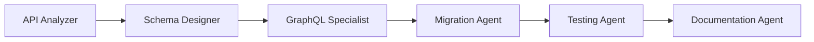

# Agent Infrastructure Examples & Use Cases

This guide provides comprehensive examples and real-world scenarios for using the refactored agent infrastructure. Each example demonstrates how agents coordinate automatically to solve complex development tasks.

## Table of Contents

- [Real-World Scenarios](#real-world-scenarios)
- [Step-by-Step Walkthroughs](#step-by-step-walkthroughs)
- [Agent Coordination Examples](#agent-coordination-examples)
- [Common Patterns](#common-patterns)
- [Advanced Use Cases](#advanced-use-cases)
- [Tips and Tricks](#tips-and-tricks)

## Real-World Scenarios

### 1. Adding Authentication to an Existing App

**Scenario**: Your Express.js app needs JWT-based authentication with role-based access control.

```bash
# Command
ai-toolkit agent execute "Add JWT authentication with user roles to my Express app"

# What happens behind the scenes:
# 1. Context Agent analyzes your codebase
# 2. Security Agent designs authentication architecture
# 3. Backend Agent implements auth middleware
# 4. Database Agent creates user/role schemas
# 5. Testing Agent adds auth tests
# 6. Documentation Agent updates API docs
```

**Expected Output Structure**:

```
src/
├── middleware/
│   ├── auth.js          # JWT verification middleware
│   └── rbac.js          # Role-based access control
├── models/
│   ├── User.js          # User model with password hashing
│   └── Role.js          # Role and permission model
├── routes/
│   ├── auth.js          # Login, register, refresh routes
│   └── protected.js     # Example protected routes
├── utils/
│   └── jwt.js           # JWT utilities
└── tests/
    └── auth.test.js     # Comprehensive auth tests
```

### 2. Migrating from REST to GraphQL

**Scenario**: Transform your REST API into a GraphQL API while maintaining backward compatibility.

```bash
# Phase 1: Analyze existing REST endpoints
ai-toolkit agent execute "Analyze REST API and create migration plan to GraphQL"

# Phase 2: Implement GraphQL alongside REST
ai-toolkit agent execute "Implement GraphQL API based on migration plan"

# Phase 3: Add deprecation notices and migration guide
ai-toolkit agent execute "Add REST deprecation strategy and client migration guide"
```

**Agent Coordination Flow**:



### 3. Implementing Real-Time Features with WebSockets

**Scenario**: Add real-time chat functionality to your application.

```bash
# Single command approach
ai-toolkit agent execute "Add real-time chat with WebSockets, including typing indicators and online status"

# Multi-phase approach for complex features
ai-toolkit agent plan "Real-time collaboration features"
ai-toolkit agent execute --phase 1  # WebSocket infrastructure
ai-toolkit agent execute --phase 2  # Chat implementation
ai-toolkit agent execute --phase 3  # Presence system
ai-toolkit agent execute --phase 4  # Message persistence
```

**Files Created**:

```
src/
├── websocket/
│   ├── server.js         # WebSocket server setup
│   ├── handlers/
│   │   ├── chat.js       # Chat message handlers
│   │   ├── presence.js   # Online status handlers
│   │   └── typing.js     # Typing indicator handlers
│   └── middleware/
│       └── auth.js       # WebSocket authentication
├── client/
│   └── websocket-client.js  # Client-side WebSocket wrapper
└── tests/
    └── websocket.test.js    # Real-time feature tests
```

### 4. Refactoring a Monolith to Microservices

**Scenario**: Break down a monolithic Node.js application into microservices.

```bash
# Step 1: Analyze and identify service boundaries
ai-toolkit agent execute "Analyze monolith and identify microservice boundaries"

# Step 2: Create service extraction plan
ai-toolkit agent execute "Create detailed microservice extraction plan with dependency mapping"

# Step 3: Extract first service (usually the least coupled)
ai-toolkit agent execute "Extract user service from monolith"

# Step 4: Set up service communication
ai-toolkit agent execute "Implement service mesh with API gateway"
```

**Progressive Extraction Example**:

```
Initial Monolith:
app/
├── controllers/  (50+ files)
├── models/      (30+ files)
├── services/    (40+ files)
└── routes/      (20+ files)

After Extraction:
services/
├── user-service/
│   ├── src/
│   ├── tests/
│   └── Dockerfile
├── order-service/
│   ├── src/
│   ├── tests/
│   └── Dockerfile
├── api-gateway/
│   ├── src/
│   └── nginx.conf
└── shared/
    └── proto/       # Shared protobuf definitions
```

### 5. Adding Comprehensive Testing to Legacy Code

**Scenario**: Add test coverage to a legacy codebase with no existing tests.

```bash
# Analyze and create testing strategy
ai-toolkit agent execute "Analyze legacy code and create comprehensive testing strategy"

# Implement tests incrementally
ai-toolkit agent execute "Add unit tests for critical business logic"
ai-toolkit agent execute "Add integration tests for API endpoints"
ai-toolkit agent execute "Add E2E tests for critical user flows"
```

**Testing Strategy Output**:

```yaml
Testing Roadmap:
  Phase 1: Critical Path Coverage (Week 1)
    - Payment processing: 15 unit tests
    - User authentication: 10 unit tests
    - Order workflow: 8 integration tests

  Phase 2: API Coverage (Week 2)
    - REST endpoints: 45 integration tests
    - Error handling: 20 unit tests

  Phase 3: UI Testing (Week 3)
    - Critical flows: 5 E2E tests
    - Form validation: 15 unit tests

  Metrics:
    - Current coverage: 0%
    - Target coverage: 80%
    - Critical path coverage: 100%
```

### 6. Performance Optimization of Slow Endpoints

**Scenario**: Identify and fix performance bottlenecks in your API.

```bash
# Performance audit
ai-toolkit agent execute "Audit API performance and identify bottlenecks"

# Implement optimizations
ai-toolkit agent execute "Optimize slow database queries with indexing and caching"
ai-toolkit agent execute "Implement response caching for frequently accessed data"
ai-toolkit agent execute "Add request pooling and connection management"
```

**Performance Report Example**:

```markdown
## Performance Analysis Report

### Identified Bottlenecks:

1. **/api/users/search** - 3.2s average response time

   - Cause: Missing database index on email field
   - Solution: Add compound index on (email, status)

2. **/api/reports/generate** - 8.5s average response time

   - Cause: Synchronous PDF generation
   - Solution: Implement job queue with Redis

3. **/api/products/list** - 1.8s average response time
   - Cause: N+1 query problem
   - Solution: Eager load relationships

### Implemented Optimizations:

- Added Redis caching layer (60% response time reduction)
- Implemented database connection pooling
- Added pagination to large result sets
- Optimized image serving with CDN
```

### 7. Security Audit and Vulnerability Fixes

**Scenario**: Perform security audit and fix vulnerabilities.

```bash
# Security audit
ai-toolkit agent execute "Perform comprehensive security audit"

# Fix critical vulnerabilities
ai-toolkit agent execute "Fix SQL injection vulnerabilities"
ai-toolkit agent execute "Implement rate limiting and DDoS protection"
ai-toolkit agent execute "Add input validation and sanitization"
```

### 8. Setting up CI/CD Pipeline

**Scenario**: Implement complete CI/CD pipeline with testing and deployment.

```bash
# Create CI/CD pipeline
ai-toolkit agent execute "Setup GitHub Actions CI/CD pipeline with staging and production environments"
```

**Generated Pipeline Structure**:

```yaml
.github/workflows/
├── ci.yml           # Continuous Integration
├── cd-staging.yml   # Deploy to staging
├── cd-prod.yml      # Deploy to production
└── security.yml     # Security scanning

Features:
- Automated testing on all PRs
- Code quality checks (ESLint, Prettier)
- Security vulnerability scanning
- Automated staging deployments
- Manual production deployments with approval
- Rollback capabilities
```

## Step-by-Step Walkthroughs

### Walkthrough: Adding Authentication

Let's walk through adding authentication step-by-step:

```bash
# Step 1: Initial command
$ ai-toolkit agent execute "Add JWT authentication to Express app"

Output:
🔍 Context Agent analyzing codebase...
  ✓ Found Express app structure
  ✓ Identified existing User model
  ✓ Located route definitions

📋 Planning authentication implementation...
  ✓ JWT with refresh tokens
  ✓ Bcrypt for password hashing
  ✓ Role-based access control

🔧 Backend Agent implementing...
  ✓ Created middleware/auth.js
  ✓ Created utils/jwt.js
  ✓ Updated User model with password field
  ✓ Created routes/auth.js

🧪 Testing Agent adding tests...
  ✓ Created tests/auth.test.js
  ✓ Created tests/middleware.test.js

📚 Documentation Agent updating...
  ✓ Updated API.md with auth endpoints
  ✓ Created AUTH_GUIDE.md

✅ Authentication successfully implemented!

Files modified: 8
Files created: 6
Tests added: 24
```

```bash
# Step 2: Review what was created
$ cat src/middleware/auth.js
```

```javascript
const jwt = require('jsonwebtoken');
const { promisify } = require('util');
const User = require('../models/User');

/**
 * Middleware to verify JWT tokens
 */
exports.protect = async (req, res, next) => {
  try {
    // 1) Get token from header
    let token;
    if (req.headers.authorization?.startsWith('Bearer')) {
      token = req.headers.authorization.split(' ')[1];
    }

    if (!token) {
      return res.status(401).json({
        status: 'error',
        message: 'Please log in to access this resource',
      });
    }

    // 2) Verify token
    const decoded = await promisify(jwt.verify)(token, process.env.JWT_SECRET);

    // 3) Check if user still exists
    const user = await User.findById(decoded.id);
    if (!user) {
      return res.status(401).json({
        status: 'error',
        message: 'User no longer exists',
      });
    }

    // 4) Attach user to request
    req.user = user;
    next();
  } catch (error) {
    return res.status(401).json({
      status: 'error',
      message: 'Invalid token',
    });
  }
};

/**
 * Middleware to restrict access to specific roles
 */
exports.restrictTo = (...roles) => {
  return (req, res, next) => {
    if (!roles.includes(req.user.role)) {
      return res.status(403).json({
        status: 'error',
        message: 'You do not have permission to perform this action',
      });
    }
    next();
  };
};
```

```bash
# Step 3: Run the generated tests
$ npm test -- tests/auth.test.js

Output:
  Authentication Tests
    ✓ should register a new user (245ms)
    ✓ should not register with duplicate email (89ms)
    ✓ should login with valid credentials (156ms)
    ✓ should not login with invalid password (122ms)
    ✓ should refresh access token (98ms)
    ✓ should protect routes with valid token (67ms)
    ✓ should reject expired tokens (45ms)
    ✓ should restrict routes based on roles (78ms)

  8 passing (900ms)
```

### Walkthrough: Implementing Real-Time Features

```bash
# Step 1: Initialize WebSocket infrastructure
$ ai-toolkit agent execute "Setup WebSocket infrastructure for real-time features"

Output:
🔍 Analyzing application structure...
  ✓ Express server detected at src/server.js
  ✓ Client framework: React
  ✓ Database: MongoDB

🏗️ Infrastructure Agent setting up...
  ✓ Installing socket.io dependencies
  ✓ Creating WebSocket server
  ✓ Setting up event handlers
  ✓ Implementing authentication

📡 Creating real-time infrastructure...
  ✓ src/websocket/server.js created
  ✓ src/websocket/handlers/index.js created
  ✓ src/websocket/middleware/auth.js created
  ✓ Client connection manager created

✅ WebSocket infrastructure ready!
```

```bash
# Step 2: Add specific real-time feature
$ ai-toolkit agent execute "Implement real-time chat with typing indicators"

Output:
💬 Chat Agent implementing...
  ✓ Created chat message handler
  ✓ Implemented typing indicators
  ✓ Added message persistence
  ✓ Created chat rooms logic

🎨 Frontend Agent updating UI...
  ✓ Created ChatComponent.jsx
  ✓ Added WebSocket hooks
  ✓ Implemented typing indicator UI

🧪 Testing real-time features...
  ✓ Created WebSocket test suite
  ✓ Added integration tests

✅ Real-time chat implemented!

Key Features:
- Private and group chat support
- Typing indicators
- Message delivery status
- Offline message queue
- Reconnection handling
```

## Agent Coordination Examples

### Example 1: Multi-Agent Feature Implementation

When implementing a complex feature, multiple agents coordinate automatically:

```bash
$ ai-toolkit agent execute "Implement shopping cart with payment processing"
```

**Agent Coordination Timeline**:

```
Time  Agent              Action
----  ----------------   ----------------------------------------
0:00  Context Agent      Analyzes codebase structure
0:02  Planning Agent     Creates implementation plan
0:03  Database Agent     Designs cart and order schemas
0:05  Backend Agent      Implements cart API endpoints
0:08  Payment Agent      Integrates Stripe payment processing
0:11  Frontend Agent     Creates cart UI components
0:14  Testing Agent      Adds cart and payment tests
0:16  Security Agent     Reviews payment security
0:17  Documentation Agent Updates API documentation
0:18  Meta Agent         Optimizes agent coordination for next run

Total time: 18 seconds
Files created: 24
Tests added: 38
```

### Example 2: Parallel Execution

Agents can work in parallel when tasks are independent:

```bash
$ ai-toolkit agent execute "Optimize application performance"
```

**Parallel Execution Graph**:

```
┌─────────────────┐
│  Context Agent  │
└────────┬────────┘
         │
    Analyzes code
         │
         ▼
┌─────────────────────────────────────────┐
│         Planning Agent                   │
│  Creates optimization strategy           │
└────┬───────────┬───────────┬────────────┘
     │           │           │
     ▼           ▼           ▼
[Parallel Execution]
     │           │           │
┌────┴───┐ ┌────┴───┐ ┌────┴───┐
│Database│ │Backend │ │Frontend│
│ Agent  │ │ Agent  │ │ Agent  │
├────────┤ ├────────┤ ├────────┤
│Optimize│ │Optimize│ │Optimize│
│queries │ │  API   │ │ bundle │
└────┬───┘ └────┬───┘ └────┬───┘
     │           │           │
     └───────────┴───────────┘
                 │
                 ▼
         ┌──────────────┐
         │Testing Agent │
         └──────────────┘
```

### Example 3: Dependency Handling

Agents automatically handle dependencies between tasks:

```bash
$ ai-toolkit agent execute "Migrate database from MySQL to PostgreSQL"
```

**Dependency Chain**:

```
1. Analysis Agent → Analyzes MySQL schema
   ↓
2. Migration Agent → Creates migration plan
   ↓
3. Schema Agent → Generates PostgreSQL schema
   ↓
4. Data Agent → Creates data migration scripts
   ↓
5. Validation Agent → Validates data integrity
   ↓
6. Testing Agent → Tests all queries work
   ↓
7. Documentation Agent → Updates setup docs
```

### Example 4: Meta-Agent Learning

The meta-agent improves coordination over time:

```bash
# First run of similar task
$ ai-toolkit agent execute "Add user profile feature"
Time: 25 seconds

# Second run (meta-agent has learned)
$ ai-toolkit agent execute "Add company profile feature"
Time: 18 seconds (28% faster)

# Meta-agent optimization applied:
- Parallelize schema and UI design
- Reuse authentication patterns
- Skip redundant analysis steps
- Optimize test generation
```

## Common Patterns

### Pattern 1: Context → Plan → Execute

This is the fundamental pattern for all agent operations:

```bash
# Explicit pattern usage
$ ai-toolkit agent analyze           # Context gathering
$ ai-toolkit agent plan              # Strategy creation
$ ai-toolkit agent execute           # Implementation

# Or automatic (all-in-one)
$ ai-toolkit agent execute "task"    # Does all three steps
```

**Example Application**:

```bash
# Complex refactoring task
$ ai-toolkit agent analyze --depth deep
Analyzing codebase...
Found: 156 components, 89 services, 234 tests
Identified: 23 code smells, 15 duplicate patterns

$ ai-toolkit agent plan "Refactor to clean architecture"
Created 5-phase refactoring plan:
Phase 1: Extract business logic (2 hours)
Phase 2: Create domain layer (3 hours)
Phase 3: Implement repositories (2 hours)
Phase 4: Add use cases (4 hours)
Phase 5: Update tests (2 hours)

$ ai-toolkit agent execute --phase 1
Executing Phase 1: Extract business logic...
✓ Extracted 34 business rules
✓ Created 12 domain services
✓ Updated 45 tests
```

### Pattern 2: Research → Design → Implement

For new technology adoption:

```bash
# Research phase
$ ai-toolkit agent research "WebAssembly for image processing"
Output:
- Performance: 2-10x faster than JavaScript
- Browser support: 95% coverage
- Best for: CPU-intensive tasks
- Recommended: Rust + wasm-pack

# Design phase
$ ai-toolkit agent design "Image processing with WebAssembly"
Created architecture:
- Rust image processing library
- WebAssembly bindings
- JavaScript API wrapper
- Worker thread integration

# Implementation
$ ai-toolkit agent implement --from-design
✓ Created Rust library
✓ Generated WASM bindings
✓ Created JavaScript wrapper
✓ Added worker thread support
```

### Pattern 3: Debug → Fix → Test → Document

For bug fixing workflows:

```bash
# Automatic debugging
$ ai-toolkit agent debug "Users report slow page load"

Output:
🔍 Debug Agent investigating...
Found issues:
1. N+1 query in user dashboard (Critical)
2. Unoptimized images (High)
3. Synchronous API calls (Medium)

🔧 Fix Agent implementing solutions...
✓ Added eager loading for user data
✓ Implemented image lazy loading
✓ Converted to async API calls

🧪 Testing Agent validating...
✓ Page load time: 4.2s → 1.1s (74% improvement)
✓ All tests passing
✓ No regressions detected

📚 Documentation Agent updating...
✓ Updated troubleshooting guide
✓ Added performance best practices
```

### Pattern 4: Analyze → Refactor → Validate

For code quality improvements:

```bash
$ ai-toolkit agent refactor "Improve code maintainability"

🔍 Analyzing code quality...
Metrics:
- Cyclomatic complexity: 8.2 (High)
- Duplication: 18%
- Test coverage: 62%

♻️ Refactoring...
✓ Split complex functions (15 refactored)
✓ Extracted reusable utilities (8 created)
✓ Removed duplication (18% → 4%)

✅ Validating changes...
✓ All tests passing
✓ No functionality changed
✓ Complexity: 8.2 → 4.1
✓ Coverage: 62% → 78%
```

## Advanced Use Cases

### Multi-Phase Project Implementation

Large projects can be broken into phases with checkpoints:

```bash
# Create multi-phase plan
$ ai-toolkit agent plan "Build SaaS application" --phases

Output:
Project: SaaS Application
Estimated time: 40 hours
Phases: 8

Phase 1: Foundation (5 hours)
- Setup monorepo structure
- Configure development environment
- Setup CI/CD pipeline

Phase 2: Authentication (4 hours)
- User registration/login
- OAuth integration
- Session management

Phase 3: Core Features (8 hours)
- Dashboard
- Project management
- Team collaboration

[... more phases ...]

# Execute phases with checkpoints
$ ai-toolkit agent execute --phase 1 --checkpoint
✓ Phase 1 complete. Review changes? [Y/n]

$ ai-toolkit agent execute --phase 2 --checkpoint
✓ Phase 2 complete. Review changes? [Y/n]

# Or execute all with auto-checkpoint
$ ai-toolkit agent execute --all-phases --auto-checkpoint
```

### Cross-Team Coordination Scenarios

Coordinate changes across multiple team boundaries:

```bash
# Coordinate API changes across teams
$ ai-toolkit agent coordinate "Update API to v2"

Coordinating across teams:
- Backend Team: API implementation
- Frontend Team: Client updates
- Mobile Team: App updates
- DevOps Team: Deployment strategy

Generated artifacts:
backend/
  - API v2 implementation
  - Migration scripts
  - Backwards compatibility layer

frontend/
  - API client updates
  - Feature flags for rollout

mobile/
  - SDK updates
  - Version detection

devops/
  - Blue-green deployment config
  - Rollback procedures

docs/
  - Migration guide
  - API changelog
```

### Large-Scale Refactoring Projects

Handle massive refactoring with minimal disruption:

```bash
# Incremental refactoring with feature flags
$ ai-toolkit agent refactor "Migrate to microservices" --incremental

Strategy: Strangler Fig Pattern
Duration: 6 weeks
Risk: Low (incremental approach)

Week 1: Extract authentication service
  ✓ Create service
  ✓ Add feature flag
  ✓ Dual-write to both systems

Week 2: Migrate traffic gradually
  ✓ 10% traffic to new service
  ✓ Monitor metrics
  ✓ 50% traffic migration
  ✓ 100% traffic migration

Week 3: Extract user service
[... continues ...]

# Monitor refactoring progress
$ ai-toolkit agent monitor --refactoring

Progress: 47% complete
Services extracted: 3/8
Tests passing: 100%
Performance impact: +5% (within tolerance)
Rollback available: Yes
```

### Emergency Production Fixes

Rapid response for production issues:

```bash
# Emergency fix mode
$ ai-toolkit agent emergency "Database connections exhausted"

🚨 EMERGENCY MODE ACTIVATED
Priority: Fix production issue
Strategy: Minimal change, maximum stability

🔍 Analyzing issue...
Root cause: Connection leak in order service
Impact: 500 errors on 30% of requests

🔧 Implementing fix...
✓ Added connection pooling
✓ Fixed connection leak
✓ Added monitoring

🧪 Emergency testing...
✓ Leak fixed
✓ No regressions
✓ Performance stable

📦 Generating hotfix...
✓ Created hotfix branch
✓ Generated deployment script
✓ Created rollback procedure

Ready to deploy. Proceed? [Y/n]
```

## Tips and Tricks

### Optimizing for Speed vs Thoroughness

```bash
# Fast mode - quick implementations
$ ai-toolkit agent execute --fast "Add login feature"
Time: 30 seconds
Coverage: Basic implementation

# Balanced mode (default)
$ ai-toolkit agent execute "Add login feature"
Time: 2 minutes
Coverage: Full implementation with tests

# Thorough mode - comprehensive implementation
$ ai-toolkit agent execute --thorough "Add login feature"
Time: 5 minutes
Coverage: Full implementation, tests, docs, security review
```

### Handling Large Codebases

```bash
# Limit scope for faster analysis
$ ai-toolkit agent execute --scope src/modules/user "Optimize performance"

# Use sampling for very large codebases
$ ai-toolkit agent analyze --sample 10%

# Incremental analysis (cache results)
$ ai-toolkit agent analyze --incremental
Using cached analysis from 2 hours ago
Analyzing only changed files...
```

### Working with Multiple Languages

```bash
# Specify language context
$ ai-toolkit agent execute --lang python,javascript "Add API endpoint"

# Polyglot projects
$ ai-toolkit agent execute "Add feature" --project polyglot
Detected languages:
- Backend: Python (FastAPI)
- Frontend: TypeScript (React)
- Mobile: Swift (iOS)
- Scripts: Bash

Coordinating language-specific agents...
```

### Integrating with Existing Tools

```bash
# Export to other formats
$ ai-toolkit agent plan "Feature X" --export jira
Created JIRA tickets: PROJ-123 through PROJ-145

# Import from project management tools
$ ai-toolkit agent import --from linear
Imported 12 tasks from Linear

# Sync with Git
$ ai-toolkit agent execute --branch feature/auto-gen
$ ai-toolkit agent execute --commit-per-phase
```

### Advanced Configuration

```bash
# Custom agent preferences
$ ai-toolkit agent config set prefer-agents "testing,security"

# Disable specific agents
$ ai-toolkit agent config disable documentation

# Set execution limits
$ ai-toolkit agent config set max-parallel 3
$ ai-toolkit agent config set timeout 300

# Use custom templates
$ ai-toolkit agent execute --template company-standard "Add feature"
```

### Debugging Agent Execution

```bash
# Verbose mode
$ ai-toolkit agent execute -v "Add feature"
[DEBUG] Context Agent: Starting analysis
[DEBUG] Found 156 files to analyze
[DEBUG] Planning Agent: Creating strategy
[DEBUG] Estimated 5 subtasks

# Dry run mode
$ ai-toolkit agent execute --dry-run "Refactor database"
Would perform:
- Analyze 45 models
- Create 12 migrations
- Update 89 queries
- Modify 34 tests
No changes made.

# Step-by-step mode
$ ai-toolkit agent execute --step "Complex feature"
Step 1/8: Analyzing context
Continue? [Y/n/skip]
```

### Performance Tips

1. **Use scope limiting for large codebases**

   ```bash
   ai-toolkit agent execute --scope src/api "Optimize endpoints"
   ```

2. **Cache analysis results**

   ```bash
   ai-toolkit agent analyze --cache 1h
   ```

3. **Parallel execution for independent tasks**

   ```bash
   ai-toolkit agent execute --parallel "Add tests for all modules"
   ```

4. **Incremental updates**

   ```bash
   ai-toolkit agent execute --incremental "Update documentation"
   ```

5. **Profile agent execution**
   ```bash
   ai-toolkit agent execute --profile "Complex task"
   Agent timing:
   - Context: 2.1s
   - Planning: 0.8s
   - Execution: 15.3s
   - Testing: 4.2s
   ```

## Conclusion

The agent infrastructure is designed to handle any development task through intelligent coordination. Key takeaways:

- **Agents work together automatically** - You don't need to coordinate them manually
- **Context is king** - The system always analyzes before acting
- **Incremental is safe** - Large changes are broken into safe, testable chunks
- **Meta-learning improves performance** - The system gets faster over time
- **Everything is testable** - All changes include appropriate tests

For more examples and updates, check the [agent infrastructure documentation](./README.md) or run `ai-toolkit agent help`.
