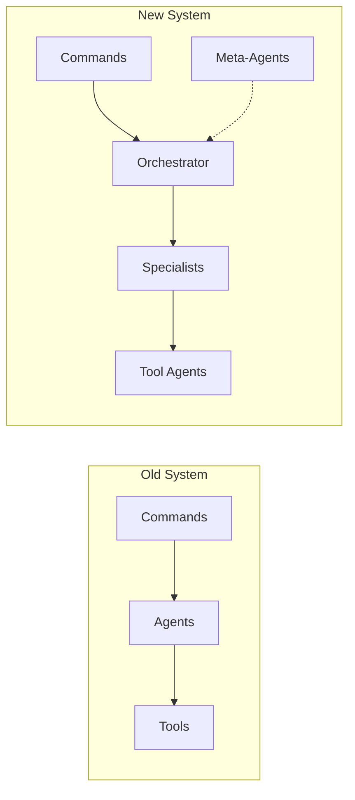
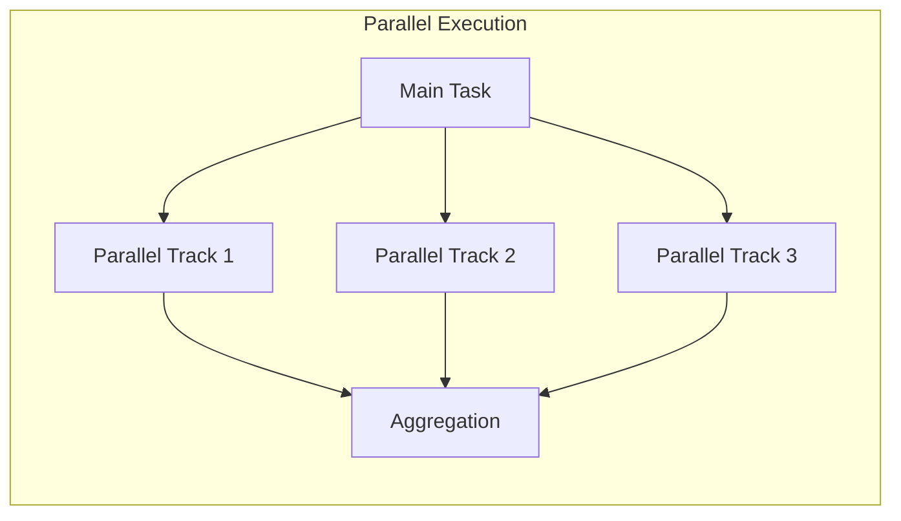

# Migration Guide: Hierarchical Agent Infrastructure

## Executive Summary

The AI Toolkit agent infrastructure has undergone a significant architectural transformation, moving from a flat command-based system to a sophisticated hierarchical agent model with intelligent orchestration, meta-learning capabilities, and advanced context management. This guide provides a comprehensive migration path for users transitioning to the new system.

## Table of Contents

1. [What's Changed](#whats-changed)
2. [Breaking Changes](#breaking-changes)
3. [Migration Steps](#migration-steps)
4. [Before and After Examples](#before-and-after-examples)
5. [New Capabilities](#new-capabilities)
6. [Best Practices](#best-practices)
7. [Performance Considerations](#performance-considerations)
8. [Troubleshooting](#troubleshooting)

## What's Changed

### From Flat to Hierarchical Agent Structure

The agent system has evolved from a simple flat structure to a sophisticated four-tier hierarchy:



### New Agents Added

#### Orchestration Layer

- **agent-orchestrator**: Master coordinator for all workflows
- **agent-capability-analyst**: Sophisticated capability matching and scoring

#### Meta-Agents (Self-Improvement)

- **agent-optimizer**: Performance analysis and optimization
- **prompt-engineer**: Prompt refinement and optimization
- **pattern-learner**: Pattern extraction and reuse
- **feedback-collector**: Quality metrics and continuous improvement

#### Enhanced Specialists

- **context-loader**: Advanced context management with checkpointing
- **performance-analyzer**: Performance bottleneck identification
- **security-analyzer**: Security vulnerability detection
- **style-enforcer**: Multi-language style enforcement with auto-fixes

### Commands Consolidated

#### Plan Commands Unified

```diff
- /plan-feature    # REMOVED: Merged into /plan
- /plan-refactor   # REMOVED: Merged into /plan
- /plan-bugfix     # REMOVED: Merged into /plan
+ /plan            # UNIFIED: Handles all planning scenarios
```

The new `/plan` command intelligently adapts to task complexity:

- Simple bug fixes → Basic task list
- Features → Story-level decomposition
- Complex systems → Epic-level hierarchy with risk assessment

### Commands Removed

#### The /implement Command

```diff
- /implement  # REMOVED: Implementation is orchestrated, not commanded
```

**Why removed?** The implementation workflow now follows a more sophisticated pattern:

1. Plan creation (`/plan`)
2. Orchestrator coordination (`agent-orchestrator`)
3. Specialized execution (individual agents)

### Enhanced Capabilities for Existing Agents

#### Context-Loader Enhancements

- Hierarchical summarization (file → module → system)
- Versioned checkpointing with deltas
- Cross-agent context sharing via JSON-LD
- Intelligent pruning and compression
- Relevance scoring (0-100 scale)

#### Planner Enhancements

- Hierarchical task decomposition (epic/story/subtask)
- Agent assignment recommendations
- Risk assessment matrix
- Dependency analysis
- Parallel execution planning

#### Style-Enforcer Transformation

- Multi-language support (10+ languages)
- Framework-specific conventions
- Automated fix generation
- Progressive refactoring suggestions
- Team metrics and dashboards

## Breaking Changes

### 1. The /implement Command No Longer Exists

**Old approach:**

```bash
/implement "add user authentication"
```

**New approach:**

```bash
# Step 1: Build context
/understand-area authentication

# Step 2: Create plan
/plan add user authentication with JWT

# Step 3: Orchestrator handles implementation
# (Automatically coordinates agents based on plan)
```

### 2. The /plan-feature Command Has Been Merged

**Old approach:**

```bash
/plan-feature "shopping cart"     # For features
/plan-refactor "database layer"   # For refactoring
/plan-bugfix "memory leak"        # For bugs
```

**New approach:**

```bash
# Single command adapts to all scenarios
/plan add shopping cart feature
/plan refactor database layer for better performance
/plan fix memory leak in image processing
```

### 3. Agent Names Must Match File Names Exactly

**Old flexibility:**

```yaml
# Could reference agents loosely
agent: code_writer # or code-writer or CodeWriter
```

**New requirement:**

```yaml
# Must match exact hyphenated file name
agent: code-generator # Must match code-generator.md exactly
```

### 4. Context is Now Automatically Shared

**Old approach:**

```bash
# Had to manually pass context
/plan --with-context "feature description"
```

**New approach:**

```bash
# Context flows automatically
/understand-area payment-processing
/plan add refund capability  # Context automatically included
```

## Migration Steps

### Step 1: Update Your Workflow Mindset

Shift from imperative commands to declarative planning:

```diff
- Think: "Implement this feature"
+ Think: "Plan this feature, then let the orchestrator handle it"
```

### Step 2: Adopt the Context-First Approach

Always build context before planning:

```bash
# ALWAYS start with understanding
/understand-area <relevant-area>

# THEN create plans
/plan <task-description>
```

### Step 3: Leverage the Orchestrator

Instead of trying to implement directly, let the orchestrator coordinate:

```typescript
// Old: Direct implementation
const result = await command.execute('/implement', task);

// New: Orchestrated workflow
const context = await command.execute('/understand-area', area);
const plan = await command.execute('/plan', task);
// Orchestrator automatically handles implementation
```

### Step 4: Use Meta-Agents for Optimization

Enable continuous improvement:

```yaml
# In your configuration
meta_agents:
  enabled: true
  agents:
    - agent-optimizer # Performance tuning
    - pattern-learner # Knowledge extraction
    - prompt-engineer # Prompt refinement
    - feedback-collector # Quality metrics
```

### Step 5: Adopt Hierarchical Task Decomposition

Structure complex tasks properly:

```yaml
# Old: Flat task list
tasks:
  - implement login
  - implement registration
  - add password reset

# New: Hierarchical structure
epic:
  title: User Authentication System
  stories:
    - title: User Login
      subtasks:
        - implement login form
        - add validation
        - integrate with backend
    - title: User Registration
      subtasks:
        - create registration flow
        - add email verification
        - implement onboarding
```

## Before and After Examples

### Example 1: Simple Bug Fix

#### Before (Old System)

```bash
# Direct implementation command
/implement "fix null pointer exception in checkout"

# Or using specific command
/fix-bug "null pointer in checkout process"
```

#### After (New System)

```bash
# Build understanding first
/understand-area checkout process

# Create targeted plan
/plan fix null pointer exception in checkout

# The orchestrator will:
# 1. Assign debug-assistant for root cause analysis
# 2. Use code-generator for the fix
# 3. Invoke test-writer for regression tests
# 4. Pattern-learner captures the fix pattern
```

### Example 2: Feature Development

#### Before (Old System)

```bash
# Separate planning command
/plan-feature "add OAuth2 authentication"

# Then implement
/implement "OAuth2 authentication based on plan"
```

#### After (New System)

```bash
# Comprehensive understanding
/understand-area authentication system

# Unified planning with automatic complexity detection
/plan add OAuth2 authentication with Google and GitHub

# Orchestrator coordinates:
# - security-analyzer for threat modeling
# - code-generator for OAuth modules
# - test-writer for auth tests
# - doc-writer for API documentation
# - performance-analyzer for bottleneck prevention
```

### Example 3: Complex Refactoring

#### Before (Old System)

```bash
# Multiple separate commands
/analyze "database layer"
/plan-refactor "improve database performance"
/implement "database refactoring plan"
```

#### After (New System)

```bash
# Deep context building
/understand-area database layer and data access patterns

# Comprehensive refactoring plan
/plan refactor database layer for improved performance and maintainability

# Orchestrator creates execution graph:
# Parallel Track 1:
#   - performance-analyzer identifies bottlenecks
#   - pattern-learner extracts current patterns
#
# Parallel Track 2:
#   - security-analyzer checks for vulnerabilities
#   - style-enforcer identifies code smells
#
# Sequential Track:
#   - refactorer applies improvements
#   - test-writer ensures backward compatibility
#   - doc-writer updates architecture docs
```

### Example 4: Command Usage Comparison

#### Old Command Patterns

```bash
# Scattered commands for different purposes
/analyze-code src/auth
/plan-feature "2FA support"
/implement "add 2FA to auth"
/generate-tests src/auth
/document src/auth
```

#### New Command Patterns

```bash
# Cohesive workflow with intelligent orchestration
/understand-area src/auth    # Builds comprehensive context
/plan add 2FA support         # Creates hierarchical plan with agent assignments
# Orchestrator handles everything else automatically
```

### Example 5: Agent Invocation Patterns

#### Old Pattern: Direct Agent Calls

```typescript
// Manually coordinate agents
const analyst = await getAgent('code-analyzer');
const writer = await getAgent('code-writer');
const tester = await getAgent('test-generator');

const analysis = await analyst.execute(task);
const code = await writer.execute(analysis);
const tests = await tester.execute(code);
```

#### New Pattern: Orchestrated Coordination

```typescript
// Orchestrator handles everything
const orchestrator = await getAgent('agent-orchestrator');
const result = await orchestrator.execute({
  task: 'implement feature',
  context: contextLoaderFindings,
  strategy: 'adaptive', // auto, parallel, sequential, or fallback
});

// Orchestrator automatically:
// - Decomposes task
// - Selects appropriate agents
// - Manages execution order
// - Aggregates results
// - Engages meta-agents for optimization
```

## New Capabilities

### 1. Hierarchical Task Decomposition

The system now supports multi-level task breakdown:

```yaml
decomposition_levels:
  epic: # Weeks to months
    - Major features
    - Architectural changes
    - Cross-team initiatives

  story: # Days to week
    - User-facing functionality
    - Testable deliverables
    - Clear acceptance criteria

  subtask: # Hours to day
    - Atomic units
    - Single responsibility
    - Immediate actionability
```

### 2. Parallel Execution

Intelligent parallelization based on dependency analysis:



### 3. Meta-Agent Continuous Improvement

Self-optimizing system through feedback loops:

```yaml
meta_agent_capabilities:
  agent-optimizer:
    - Performance metric analysis
    - Bottleneck identification
    - Optimization recommendations

  pattern-learner:
    - Success pattern extraction
    - Failure mode documentation
    - Reusable template creation

  prompt-engineer:
    - Prompt clarity improvement
    - Token efficiency optimization
    - Context optimization

  feedback-collector:
    - Quality metric tracking
    - User satisfaction monitoring
    - Performance benchmarking
```

### 4. Advanced Context Management

Sophisticated context handling with the enhanced context-loader:

```yaml
context_features:
  hierarchical_summarization:
    - File-level summaries
    - Module-level abstractions
    - System-level overview

  checkpointing:
    - Versioned snapshots
    - Incremental updates
    - Delta generation
    - History tracking

  intelligent_sharing:
    - JSON-LD format
    - Selective extraction
    - Merge strategies
    - Cross-agent protocols
```

### 5. Pattern Learning and Reuse

Systematic knowledge capture and application:

```yaml
pattern_lifecycle:
  extraction:
    - Analyze successful executions
    - Identify common patterns
    - Document best practices

  validation:
    - Test pattern effectiveness
    - Measure success rates
    - Refine patterns

  application:
    - Generate templates
    - Provide recommendations
    - Automate common tasks
```

## Best Practices

### When to Use Which Agents

#### Planning and Architecture

```bash
# For any planning need
/plan <task>  # Automatically selects complexity level

# For plan validation
/review-plan <plan-file>
```

#### Implementation Tasks

```bash
# Let orchestrator handle based on plan
# Don't try to directly implement

# For specific focused tasks only:
/fix-bug <specific-issue>      # Targeted debugging
/refactor <specific-code>       # Focused refactoring
/gen-tests <specific-module>    # Test generation
```

#### Analysis and Understanding

```bash
# Always start with context
/understand-area <area>  # Before any major work

# For specific file understanding
/explain-file <file-path>

# For research and exploration
/research <topic>
```

### How to Structure Complex Tasks

#### 1. Use Epic-Level Decomposition for Large Features

```yaml
epic: Authentication System Overhaul
  duration: 2-4 weeks
  stories:
    - OAuth2 Integration (3-5 days)
    - Multi-Factor Authentication (2-3 days)
    - Session Management Improvements (2-3 days)
    - Security Audit and Hardening (1-2 days)
```

#### 2. Define Clear Dependencies

```yaml
task_dependencies:
  database_schema_update:
    depends_on: []

  api_implementation:
    depends_on: [database_schema_update]

  frontend_integration:
    depends_on: [api_implementation]

  testing:
    depends_on: [frontend_integration]
    parallel_with: [documentation]
```

#### 3. Specify Risk Mitigation

```yaml
risk_assessment:
  high_risks:
    - data_migration:
        probability: high
        impact: critical
        mitigation:
          - Create backup strategy
          - Implement rollback mechanism
          - Test on staging first
```

### Optimal Workflow Patterns

#### Pattern 1: Context-Driven Development

```bash
# 1. Deep understanding
/understand-area payment-processing

# 2. Comprehensive planning
/plan add subscription billing feature

# 3. Let orchestrator handle implementation
# (Automatic agent coordination)

# 4. Monitor progress
/monitor implementation-metrics
```

#### Pattern 2: Iterative Refinement

```bash
# Initial planning
/plan refactor legacy module

# Review and refine
/review-plan refactoring-plan.md

# Execute with meta-agent learning
# (Pattern-learner captures successful patterns)
```

#### Pattern 3: Parallel Feature Development

```yaml
parallel_development:
  track_1:
    - Frontend components
    - UI/UX implementation
    - Client-side validation

  track_2:
    - Backend API
    - Database schema
    - Server-side validation

  track_3:
    - Testing framework
    - Documentation
    - DevOps setup
```

## Performance Considerations

### Context Optimization

Minimize context overhead while maintaining quality:

```yaml
context_strategies:
  lazy_loading:
    - Load only when needed
    - Cache frequently used context
    - Expire stale context

  compression:
    - Semantic deduplication
    - Progressive summarization
    - Relevance filtering

  sharing:
    - Use JSON-LD format
    - Share only necessary fields
    - Implement merge strategies
```

### Parallel Execution Optimization

Maximize throughput with intelligent parallelization:

```yaml
parallelization_rules:
  identify_independent_tasks:
    - No shared dependencies
    - No resource conflicts
    - Clear interfaces

  batch_similar_operations:
    - Group file reads
    - Combine API calls
    - Aggregate results

  manage_synchronization:
    - Define clear handoff points
    - Use dependency graphs
    - Implement wait strategies
```

### Agent Selection Optimization

Efficient agent matching for optimal performance:

```yaml
selection_optimization:
  capability_scoring:
    - Cache capability scores
    - Use semantic matching
    - Apply historical performance

  team_composition:
    - Minimize handoffs
    - Maximize skill overlap
    - Balance workload

  fallback_strategies:
    - Define alternate agents
    - Implement retry logic
    - Graceful degradation
```

### Memory Management

Efficient resource utilization:

```yaml
memory_strategies:
  context_windowing:
    - Sliding window approach
    - Priority-based retention
    - Automatic pruning

  result_caching:
    - Cache agent outputs
    - Implement TTL policies
    - Smart invalidation

  checkpoint_management:
    - Incremental snapshots
    - Compressed storage
    - Selective restoration
```

## Troubleshooting

### Common Migration Issues

#### Issue 1: "Command not found: /implement"

**Solution:** Use the new workflow:

```bash
/understand-area <area>
/plan <task>
# Let orchestrator handle implementation
```

#### Issue 2: "Unknown agent: code_writer"

**Solution:** Use exact hyphenated names:

```bash
# Wrong: code_writer, codeWriter, CodeWriter
# Right: code-generator
```

#### Issue 3: "Context not available"

**Solution:** Always build context first:

```bash
/understand-area <relevant-area>
# Then proceed with planning
```

#### Issue 4: "Plan too complex"

**Solution:** Break down into smaller plans:

```bash
# Instead of one massive plan
/plan "rebuild entire application"

# Create focused plans
/plan "refactor authentication module"
/plan "modernize data access layer"
/plan "update frontend framework"
```

### Performance Issues

#### Slow Context Building

```yaml
optimization:
  - Use selective area scanning
  - Enable context caching
  - Implement incremental updates
```

#### Agent Coordination Delays

```yaml
solutions:
  - Enable parallel execution
  - Optimize dependency chains
  - Use agent result caching
```

#### Memory Constraints

```yaml
mitigation:
  - Enable context pruning
  - Use compressed checkpoints
  - Implement streaming for large operations
```

## Conclusion

The new hierarchical agent infrastructure represents a significant advancement in AI-assisted development. While there are breaking changes, the benefits include:

- **Better Organization**: Hierarchical task management
- **Improved Quality**: Specialized agents with deep expertise
- **Higher Efficiency**: Parallel execution and intelligent orchestration
- **Continuous Learning**: Meta-agents that improve over time
- **Smarter Context**: Advanced context management and sharing

By following this migration guide, you'll be able to leverage the full power of the new system while avoiding common pitfalls. Remember: the key insight is that **implementation is now orchestrated, not commanded**. Plan your work, build context, and let the intelligent orchestrator handle the complexity of coordinating specialized agents.

For additional support, consult the [ARCHITECTURE.md](./ARCHITECTURE.md) document for deep technical details about the system design.
