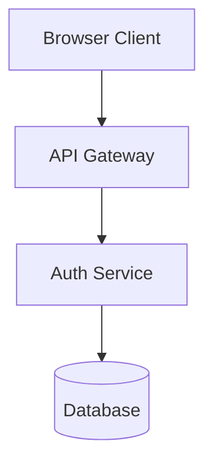
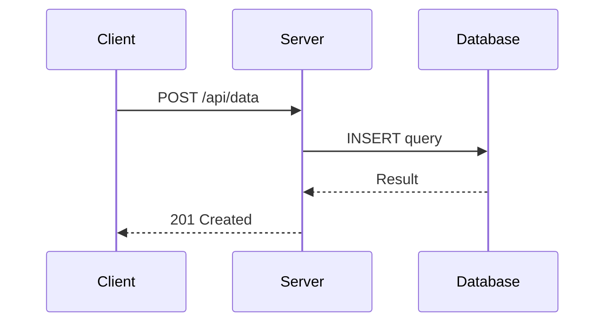

# Mermaid.js Diagram Generator

Generate valid Mermaid.js diagrams that render without syntax errors on the first attempt.

## When to Activate

- User asks to create a Mermaid diagram (flowchart, sequence, class, state, ER, Gantt, etc.)
- User asks for a diagram and Mermaid is the appropriate format
- You are generating a Mermaid code block in markdown
- User asks to fix or debug a broken Mermaid diagram

## Syntax Rules

Follow every rule below. Violating any one of them will produce a diagram that fails to render.

### 1. One Node Per Line

Each node definition must be on its own line. Never define multiple nodes on a single line.

```mermaid
%% CORRECT
A[Service A]
B[Service B]

%% WRONG - multiple nodes on one line
A[Service A] B[Service B]
```

### 2. Unique Node IDs

Node IDs must be unique within the diagram and use only letters and numbers (no spaces, hyphens, or special characters in IDs).

```mermaid
%% CORRECT
AuthService[Auth Service]
UserDB[User Database]

%% WRONG - spaces/hyphens in IDs
Auth-Service[Auth Service]
User DB[User Database]
```

### 3. Quote Labels with Special Characters

Node labels must not contain unquoted parentheses, double quotes, or other special characters. Wrap the entire label in double quotes if it contains any of these.

```mermaid
%% CORRECT
A["Process (async)"]
B["Config: key=value"]

%% WRONG - unquoted parentheses
A[Process (async)]
```

### 4. No HTML or Markdown in Labels

Do not use Markdown formatting, HTML tags, or line breaks (`<br>`, `\n`) inside node labels. Use commas or semicolons to separate items.

```mermaid
%% CORRECT
A["Input: raw data, Output: processed data"]

%% WRONG - HTML line break
A[Input: raw data<br>Output: processed data]
```

### 5. No Chained Arrows

Chained arrows (`A --> B --> C`) are not supported. Write each connection on its own line.

```mermaid
%% CORRECT
A --> B
B --> C

%% WRONG - chained arrows
A --> B --> C
```

### 6. Comments on Their Own Lines

Comments using `%%` must be on their own lines, never at the end of a code line.

```mermaid
%% CORRECT
%% This is a comment
A --> B

%% WRONG - inline comment
A --> B %% connection
```

### 7. Style Only Defined Nodes

Only apply `style` directives to nodes that have already been defined in the diagram.

```mermaid
%% CORRECT
A[Server]
style A fill:#f9f,stroke:#333

%% WRONG - styling undefined node
style A fill:#f9f,stroke:#333
A[Server]
```

### 8. Reference Only Defined Nodes

All connections must reference node IDs that are already defined or will be implicitly defined by the connection itself.

### 9. Subgraph Naming

Avoid spaces in subgraph names. Use underscores or wrap the name in quotes.

```mermaid
%% CORRECT
subgraph Backend_Services
subgraph "Backend Services"

%% WRONG - unquoted space
subgraph Backend Services
```

### 10. Always Quote Ambiguous Labels

If a node label contains parentheses, math expressions, brackets, or any characters that could be interpreted as Mermaid syntax, always wrap the label in double quotes.

```mermaid
%% CORRECT
A["calculate(x, y)"]
B["array[0]"]
C["ratio: 3/4"]

%% WRONG
A[calculate(x, y)]
B[array[0]]
```

### 11. Validate Before Presenting

Before presenting a Mermaid diagram to the user, mentally trace through it to confirm:

- [ ] Every node is defined on its own line
- [ ] All node IDs are unique and alphanumeric
- [ ] No chained arrows exist
- [ ] All labels with special characters are double-quoted
- [ ] No HTML/Markdown inside labels
- [ ] Comments are on their own lines
- [ ] Styles reference only defined nodes
- [ ] Subgraph names have no unquoted spaces

## Diagram Type Quick Reference

| Type      | Opening Directive                | Use For                                 |
| --------- | -------------------------------- | --------------------------------------- |
| Flowchart | `flowchart TD` or `flowchart LR` | Architecture, data flow, decision trees |
| Sequence  | `sequenceDiagram`                | API calls, request/response flows       |
| Class     | `classDiagram`                   | Type relationships, OOP structure       |
| State     | `stateDiagram-v2`                | State machines, lifecycle flows         |
| ER        | `erDiagram`                      | Database schemas, entity relationships  |
| Gantt     | `gantt`                          | Timelines, project schedules            |
| Git       | `gitGraph`                       | Branch strategies, merge flows          |

## Common Patterns

### Architecture Diagram



### Sequence Flow


