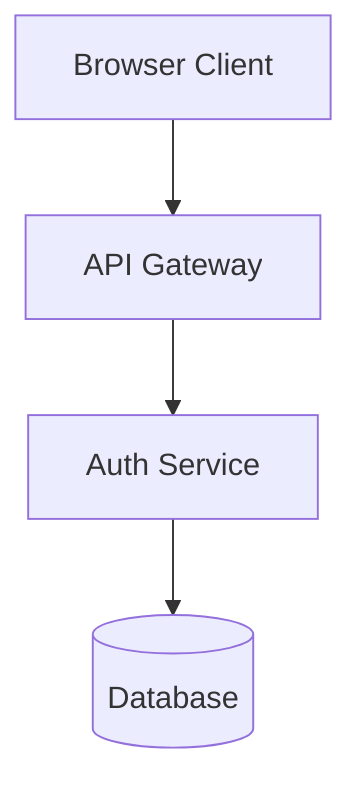
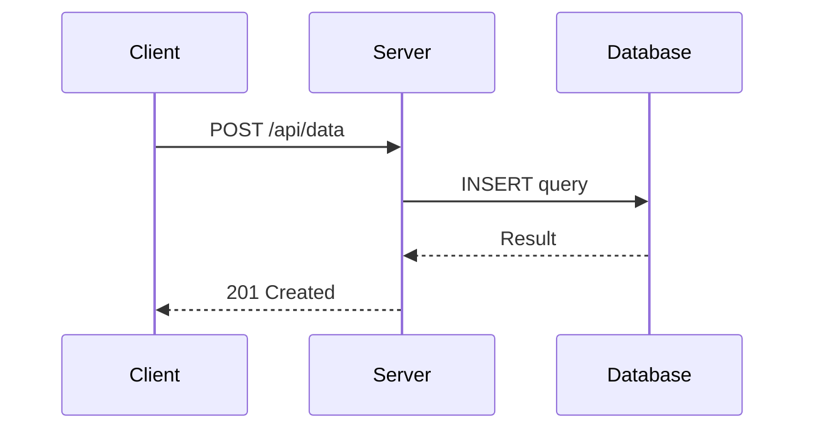

# Mermaid.js Diagram Generator

Generate valid Mermaid.js diagrams that render without syntax errors on the first attempt.

## Syntax Rules

Follow every rule below. Violating any one will produce a render failure.

### 1. One Node Per Line

```mermaid
%% CORRECT
A[Service A]
B[Service B]

%% WRONG
A[Service A] B[Service B]
```

### 2. Alphanumeric Node IDs Only

No spaces, hyphens, or special characters in IDs. Display names go in brackets.

```mermaid
%% CORRECT
AuthService[Auth Service]
UserDB[User Database]

%% WRONG
Auth-Service[Auth Service]
User DB[User Database]
```

### 3. Quote Labels with Special Characters

Wrap in double quotes if a label contains parentheses, brackets, colons, math operators, or anything that could be parsed as Mermaid syntax.

```mermaid
%% CORRECT
A["Process (async)"]
B["array[0]"]
C["ratio: 3/4"]
D["calculate(x, y)"]

%% WRONG
A[Process (async)]
B[array[0]]
```

### 4. No HTML or Markdown in Labels

Use commas or semicolons instead of `<br>` or `\n`.

```mermaid
%% CORRECT
A["Input: raw data, Output: processed"]

%% WRONG
A[Input: raw data<br>Output: processed]
```

### 5. No Chained Arrows

Write each connection on its own line.

```mermaid
%% CORRECT
A --> B
B --> C

%% WRONG
A --> B --> C
```

### 6. Comments on Their Own Lines

`%%` comments must not appear at the end of code lines.

```mermaid
%% CORRECT
%% This is a comment
A --> B

%% WRONG
A --> B %% connection
```

### 7. Style Only Defined Nodes

Apply `style` directives only after the node has been defined.

```mermaid
%% CORRECT
A[Server]
style A fill:#f9f,stroke:#333

%% WRONG
style A fill:#f9f,stroke:#333
A[Server]
```

### 8. Subgraph Names

Use underscores or wrap in quotes — no bare spaces.

```mermaid
%% CORRECT
subgraph Backend_Services
subgraph "Backend Services"

%% WRONG
subgraph Backend Services
```

### 9. Validate Before Presenting

Trace through the diagram to confirm:

- Every node on its own line with unique alphanumeric ID
- No chained arrows
- Special-character labels double-quoted
- No HTML/Markdown in labels
- Comments on own lines
- Styles reference defined nodes only
- Subgraph names quoted or underscored

## Diagram Type Quick Reference

| Type | Directive | Use For |
|------|-----------|---------|
| Flowchart | `flowchart TD` / `flowchart LR` | Architecture, data flow, decisions |
| Sequence | `sequenceDiagram` | API calls, request/response |
| Class | `classDiagram` | Type relationships, OOP |
| State | `stateDiagram-v2` | State machines, lifecycles |
| ER | `erDiagram` | Database schemas, entities |
| Gantt | `gantt` | Timelines, schedules |
| Git | `gitGraph` | Branch strategies, merges |

## Common Patterns

### Architecture Diagram



### Sequence Flow


